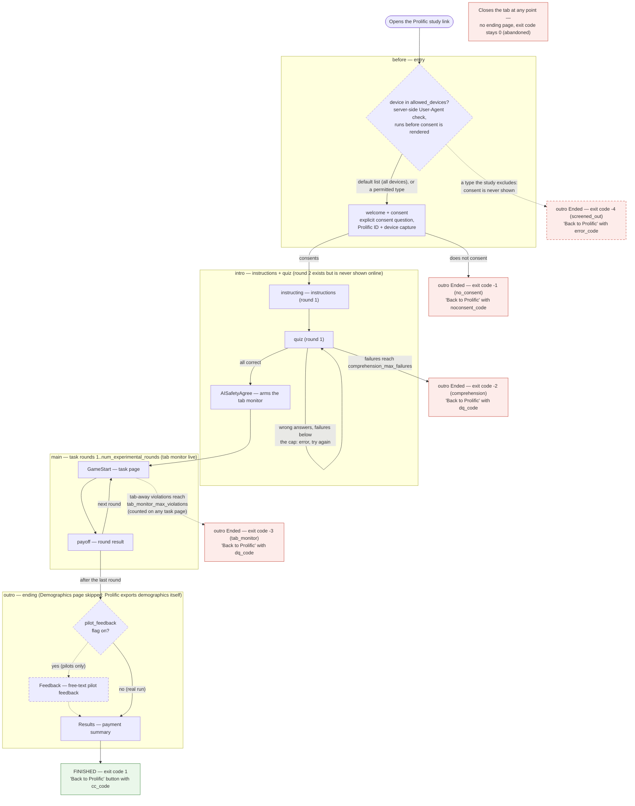
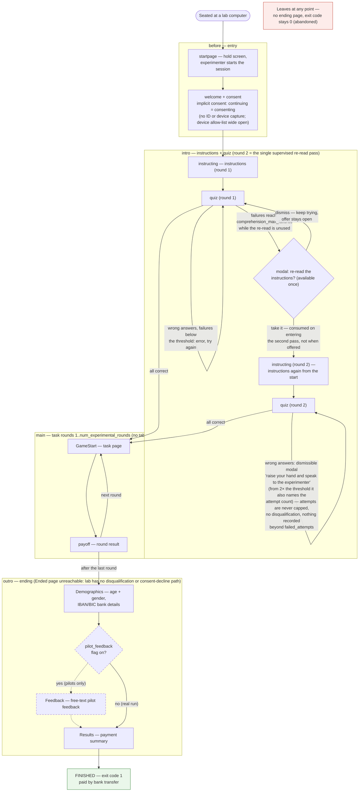

# oTree-Template
 This is a template for oTree experimental apps useful for running experiments in the lab. See `template.html` for an example of the pre-coded design and how to use it.

## App Timeline
- before (welcome + consent; online: external-ID + device capture)
- intro (instructions + quiz; optional AI-safety arming page)
- main (experimental game; optional tab monitor + passive capture)
- outro (endings: normal / disqualified / no-consent; demographics + payment; optional pilot feedback)

## Repository layout
The project root holds the four oTree apps plus a small set of top-level items:

| Item | What it's for |
| --- | --- |
| `before/` `intro/` `main/` `outro/` | the four oTree apps, run in this order (see App Timeline). `intro/` also holds `generate_instructions_preview.py`. |
| `_static/` | shared CSS/JS/HTML/images (the design system and `template.html`). |
| `scripts/` | operational scripts: `start.sh`, `prelaunch_check.py` (config guard), `predeploy_check.sh`/`.py` (upgrade gate), `export_data.py`, `format_session_data.py`, `set_up_otree.bat`. |
| `tests/` | HTTP-driven flow tests, escaping/frozen-config regressions, and the browser render check (see "Testing"). |
| `prolific/` | Prolific operational guide (`Prolific_running.md`). |
| `skills_claude/` | authoring playbooks (e.g. writing instructions). |
| `settings.py` | oTree settings: session configs, recruitment profiles, feature flags, completion codes. |
| `common.py` | shared, oTree-free helpers — **must stay at the project root** (every app does `import common`). |
| `README.md` `conventions.md` `CODEBOOK.md` `TODO.md` | project docs: overview, design principles, field/exit-code reference, and pending work. |
| `MACMINI_HOSTING.md` | private Mac mini hosting runbook (gitignored — kept local). |
| dotfiles | `.gitignore`, `.gitattributes`, etc. |

Not tracked in git: `_ai/` (agent scaffolding — pilot snapshots, performance reviews), `previews/` (regenerable instruction previews), the SQLite DB, `__pycache__`, and OS cruft.

## Running the template
It runs out of the box with no setup: `otree devserver` uses a local SQLite file
(no Postgres needed unless you set `DB_NAME`), and dev admin credentials default
to `admin`/`admin`. Set real values via env in production (`OTREE_ADMIN_USERNAME`,
`OTREE_ADMIN_PASSWORD`, `OTREE_SECRET_KEY`, `DB_*`). `DEBUG` is derived by oTree
from `OTREE_PRODUCTION` — never hardcode it.

## How to use and edit this template
- Instructions content: edit `intro/instructions_text.html`. Each `<div class="instruction-block">` is shown as one page to participants. Add, edit, or reorder blocks there to change the instruction pages.
- Quiz questions: edit `intro/quiz_items.py`. Define `QUIZ_ITEMS` entries with `field`, `prompt`, `choices`, and `answer`. The intro quiz reads directly from this file.
- Treatment assignment: edit `before/treatment_assignment.py`. Treatments are assigned when the session is created (via `creating_session` in the `before` app). Adjust `assign_treatments` to set the treatment groups you need.
- Experimental Payoff: edit `outro/payment_rule.py` to determine how participants are actually paid. The logic inside this file controls which rounds and payoffs are selected for payment at the end.

## Parameter scheme (read `conventions.md` and `settings.py` first)
Three **independent axes** at the top of `settings.py` determine everything a
participant experiences:

1. **Study type** — `recruitment`: `prolific` | `lab`. The recruitment
   plumbing, decided once per study:
   - `prolific` — external-ID capture, completion-code redirects, tab monitor,
     comprehension disqualification, passive + device capture. Paid on-platform.
   - `lab` — no Prolific plumbing, no tab monitor; collects bank details and
     demographics; supervised one-time quiz re-read instead of disqualification.
2. **DEBUG** — from the environment (`OTREE_PRODUCTION` unset → DEBUG on).
   Drives every dev affordance: skip controls, quiz solutions in the browser,
   and the `verify_quiz=False` clickthrough loosening (honoured **only** under
   DEBUG). Orthogonal to study type: a prolific-configured session under DEBUG
   still runs all its integrity modules.
3. **Pilot feedback form** — `pilot_feedback`: shows a free-text feedback page
   at the end. On for pilots/friend tests, off for the real run, regardless of
   the other two axes.

Everything optional is one **feature flag** in `SESSION_CONFIG_DEFAULTS`, shipped
**OFF**. The study-type profile is a named bundle of flag values that is
**resolved into explicit config keys at import**, so the admin session-config
view shows exactly what a session will run with. An explicit per-config flag
always overrides the profile. (There is no `testing` study type — clickthrough
loosenings belong to the DEBUG axis; see the `test` session config for the
pattern.)

Modules (all off by default): `capture_participant_id`, `completion_redirects`,
`tab_monitor`, `comprehension_dq`, `quiz_reread`, `passive_capture`,
`device_capture`, `collect_bank_details`,
`collect_demographics`, `pilot_feedback`. Thresholds (`comprehension_max_failures`,
`tab_monitor_*`) and Prolific codes (`cc_code`, `noconsent_code`, `dq_code`,
`error_code`) are config values too. Each participant records a numeric
`exit_code` (see `CODEBOOK.md`). `C.NUM_ROUNDS` is fixed at import — a config may
run fewer rounds, never more.

**`allowed_devices` (default `['phone', 'tablet', 'computer', 'unknown']`)** is
the entry DEVICE ALLOW-LIST: a study states the device types it accepts and
everything else is screened out before consent. It lives in the Prolific block
but is *not* in the prolific profile bundle — selecting the prolific study type
does **not** narrow it. With the shipped list (all four types) the check has no
participant-visible effect at all and every device proceeds normally. Narrow it
and the entry request's User-Agent is classified **server-side, before the
consent page is rendered**: an excluded device never sees consent, is recorded
with exit code `-4` (`screened_out`) plus the DETECTED TYPE as its screen-out
cause, and is sent straight to the outro ending (back to Prolific with
`error_code`), which writes a sentence for that specific device. The
client-side `is_mobile` / `device_type` values that `device_capture` fills are
measurement only and block nobody.

There are exactly four types, and **`computer` covers laptops AND desktops**: a
browser cannot tell them apart — not from the User-Agent, not from client hints
— so there is no `laptop` type and one cannot be added. `unknown` (no,
blank or unrecognised User-Agent) is its own type, so admitting or excluding
unidentifiable devices is a configuration choice, not a code change.

Every participant field, exit code, stage timestamp and future-proofing spare
column is documented in **`CODEBOOK.md`** (including the repurpose convention for
spares: never rename in place).

## Participant flow by study type

The two charts below are derived from the actual page sequences and
`is_displayed` gates (`before`, `intro`, `main`, `outro`) and the
`settings.EXIT_CODES` table. Dashed nodes/edges are **flag-dependent** (the
pilot feedback page appears only when `pilot_feedback` is on); everything else
is always part of that study type. The charts are laid out identically so the
lab/prolific differences stand out: entry (hold screen vs consent question),
the quiz-failure rule (supervised re-read vs disqualification), the tab
monitor, and the ending (bank details + demographics vs completion codes).

### Prolific



| Exit code | Terminal state | Ending the participant sees | Completion code |
|----------:|----------------|-----------------------------|-----------------|
| `1` finished | Completed the study | `outro` Results → "Back to Prolific" | `cc_code` |
| `0` abandoned | Closed the tab, never reached the end | none (handled by Prolific as timed-out/returned) | none |
| `-1` no_consent | Declined consent at entry | `outro` Ended → "Back to Prolific" | `noconsent_code` |
| `-2` comprehension | Failed the quiz `comprehension_max_failures` times | `outro` Ended → "Back to Prolific" | `dq_code` |
| `-3` tab_monitor | Tab-away violations reached the cap | `outro` Ended → "Back to Prolific" | `dq_code` |
| `-4` screened_out | Device stopped by the entry allow-list (only when `allowed_devices` is narrowed) | `outro` Ended → "Back to Prolific" (their FIRST page — consent is never shown) | `error_code` |

> **The table above is the whole table:** every code in `settings.EXIT_CODES` is
> set by real code and appears here (`CODEBOOK.md` names the line that sets
> each). A reserved-but-unwired code is a lie in the export, so it gets deleted
> rather than documented — one such code, `-5`, was removed on those grounds.

### Lab



| Exit code | Terminal state | Ending the participant sees | Completion code |
|----------:|----------------|-----------------------------|-----------------|
| `1` finished | Completed the study | `outro` Results (payment summary; paid by bank transfer) | n/a (no redirects in lab) |
| `0` abandoned | Left the session | none — `failed_attempts` and the stage timestamps are the experimenter's record | n/a |

`-1`/`-2`/`-3` cannot occur in lab: consent is implicit, and **the integrity
modules (`comprehension_dq`, `tab_monitor`) are not supported in a lab session**
— `scripts/prelaunch_check.py` FAILS on a lab config that turns either on. The
reason is conceptual: in the lab, a participant who does not consent or does not
pass the comprehension check simply cannot do the study, and that essentially
never happens because people know what they signed up for when they come to the
lab. The mechanical consequence, which is why it is a hard gate, is that a
disqualified participant is not a completer, so they skip the bank-details page
and the payment summary and are stranded at the machine. The lab's comprehension
rule is the re-read pass plus the "raise your hand" notice; a failed lab
participant is identified at analysis time by
`failed_attempts >= comprehension_max_failures` (see `CODEBOOK.md`).
`-4` cannot occur either unless you narrow `allowed_devices` on the config — it
permits every device type by default in every profile, and a lab session's
computers would pass anyway.


## Collaborating on the instructions flow with others?
You can share the instructions with coauthors who don't have the codebase installed. The generator lives in the intro app it previews: run `python3 intro/generate_instructions_preview.py` (from the project root) to produce three self-contained files in a gitignored `previews/` output dir it creates on demand: a long stacked HTML (every block on one page), an interactive single-page HTML (one block at a time, with a floating treatment switcher), and a PDF rendition. All three are fully self-contained — no external dependencies, no internet — so you can email them or drop them into a doc and they'll render the same anywhere. The interactive HTML lets coauthors click through the instructions exactly as participants would and flip between treatments live via the corner buttons; the PDF is good for printing or marking up on paper. The generated files are regenerable and never tracked in git.

## Pages by app (edit guidance)
- before
  - `before/startpage.html`: waiting page while participants take a seat; experimenter must move participants beyond; usually leave as-is unless you need different holding text.
  - `before/welcome+consent.html`: welcome and consent; should be edited to match your approved consent language.
- intro
  - `intro/instructions_text.html`: only file to edit for instructions; each `<div class="instruction-block">` you add here is displayed as its own page automatically.
  - `intro/quiz_items.py`: edit questions, choices, and correct answers; updates flow into the quiz automatically.
  - `intro/templates/` (`instructing.html`, `quiz.html`): template shells; typically do not edit.
- main
  - `main/`: This folder contains the core logic and code for your experimental task. Place the main game code, task logic, and any files that control the experiment's core flow here.
- outro
  - `outro/Results.html`: built-in results summary showing per-round payoffs and total payment; generally leave untouched. To update how payment is calculated, edit the function in `outro/payment_rule.py`.
  - `outro/Demographics.html`: collects and verifies IVAN numbers and other basic demographic questions; edit here if you need to change the questionnaire.

## Scripts (`scripts/`)
- `scripts/start.sh` : bind a session to the lab room on boot, **reusing** an
  already-bound session instead of creating a new one each time (which would
  strand in-progress participants). Authenticates REST calls with
  `OTREE_REST_KEY` when `OTREE_AUTH_LEVEL=STUDY`; fails loudly rather than
  leaving the room unbound.
- `scripts/prelaunch_check.py` : the machine-checked **pre-launch** guard as a
  standalone command (non-zero exit on any testing/placeholder value). Run it in
  the target environment, e.g. `OTREE_PRODUCTION=1 python scripts/prelaunch_check.py`.
- `scripts/predeploy_check.sh` (+ `predeploy_check.py`) : the **pre-deploy
  upgrade** gate. Boots the candidate build against a *copy* of the live database
  and drives real participants over real HTTP. See "Before a deploy" below.
- `scripts/export_data.py` : downloads `/ExportWide` and `/ExportPageTimes` over
  an authenticated admin HTTP session. NB: exporting against a database whose
  schema predates the running code returns HTTP 500 — the script says so
  explicitly instead of writing a truncated file.
- `scripts/format_session_data.py` : turns raw SENSITIVE data into i) csv for
  payment, ii) csv with anonymised experiment data, and iii) optionally a draft
  email with the anonymised file attached (recipient configurable via `--email`
  or `$SESSION_DATA_EMAIL`).
- `scripts/set_up_otree.bat` : starts oTree on the experimenter's Windows PC in
  the lab.
- `tests/` : HTTP-driven flow tests, escaping and frozen-config regression
  tests, and a measured browser render check (see "Testing" below).

> **`common.py` stays at the project root** — it is *not* in `scripts/`. All four
> apps do a top-level `import common`, and oTree puts the project root (not
> `scripts/`) on `sys.path`, so moving it would break every app's import.

## Testing

There are several kinds of check here, and that is deliberate: each one is
evidence about a different thing, and each is blind to what the others see.
**Bots are not on the list.** `otree test` bots submit through the Python API —
they never issue an HTTP POST, never render a page, never leave a
JavaScript-filled field empty and never carry a User-Agent, and three live
outages in the pilot study this template was distilled from went green under
bots while real participants got a 500. Everything below drives the real thing.

Writing a new one: read **`skills_claude/writing_tests.md`** first — it teaches
the method (drivers, the no-JS submit, visible-text assertions, escaping, frozen
configs, browser rendering checks) rather than just listing these files.

| Check | What it is evidence of | What it CANNOT catch | When to run it |
|---|---|---|---|
| **`tests/http_flow_test.py`** — walks every shipped config entry→ending over real HTTP, including a POST with the JS-produced hidden fields deliberately **empty** | a participant can complete the study in each config; no page 5xxs; the no-JS participant is not stranded | anything about how a page looks or reads; anything that only breaks for an EXISTING participant | after any change to a page, form field or flow |
| **`tests/gated_flow_test.py`** — lab vs Prolific scenarios: the one-time re-read offer, comprehension DQ, pilot feedback, the two-variant consent rule | the three orthogonal controls actually route people where the design says | rendering; data written to the export | after touching `settings.py` profiles, gates, or the intro/outro flow |
| **`tests/device_gate_test.py`** — the entry allow-list with phone, tablet, desktop and no-User-Agent requests, permitted and forbidden | a gate decided server-side from the entry REQUEST admits the listed types, screens out the rest with the DETECTED TYPE as the cause, and does nothing at all with the default list | client-side behaviour; anything past entry | after touching the entry gate or `allowed_devices` |
| **`tests/xss_escaping_test.py`** — hostile participant- and URL-supplied values through the real entry URL, in production mode | every hand-interpolated value is HTML-escaped (oTree's ibis does **not** auto-escape) and round-trips un-truncated | injection through anything you did not render in the walk | after adding any template that prints a participant- or URL-supplied value |
| **`tests/frozen_config_test.py`** — deletes parameters from a created session's stored config, then walks it | a session created BEFORE a parameter existed still completes; `common.cfg` falls back to the shipped default | a schema change (that needs a real database copy — see the pre-deploy gate) | whenever you add a session-config parameter (and add its name to the test's `STRIPPED` list) |
| **`tests/render_check.py`** — real headless Chromium at three viewports; screenshots to `_ai/render_check/`, assertions on measured element geometry and on rendered pixels | the pages are actually laid out, visible, scrollable and clickable — the failures that produce no error at all | data correctness; anything server-side | after any CSS or template-structure change |
| **`tests/render_check.py --diff`** — the same run, compared against the committed baseline `tests/geometry_baseline.json` (±3px) | a layout **regression**: something that still passes every threshold but MOVED (the Next button 40px up, a band narrowing, an eyebrow drifting). Prints page · viewport · element, old → new and the delta | anything the baseline deliberately excludes — page text, colours, pixel-darkness readings, content-random figures (all listed at the top of the baseline file) | before shipping a CSS/template change. **When the movement is INTENTIONAL, adopt it with `python tests/render_check.py --update-baseline` and let the file's own diff be the record of what moved.** |
| **`tests/example_quiz_content_test.py`** — **an EXAMPLE to copy**, not a suite member | what a page SAYS (prompts and options reach the participant, in order; answers absent in production) | anything you did not assert — content tests are only as good as their list | write your study's own version when you write your quiz |
| **`scripts/prelaunch_check.py`** — static config guard, no server, instant | the configuration is safe to open to participants: no `REPLACE_*` completion codes, `DEBUG` off, no testing loosenings left on | anything dynamic — it never runs a page | in the target environment, before opening a study |
| **`scripts/predeploy_check.sh`** — boots the candidate build against a **copy of the live database** and drives real participants | the *upgrade* is safe: an existing mid-flow participant, a fresh one and a no-JS one all survive the new code | placeholder codes and other configuration problems | before every deploy onto a database that has participants |

**The pre-deploy upgrade check is SKIPPED when there is no database.** Run with
no argument it reports the upgrade-path legs as **NOT TESTED** (never PASS) and
prints `THE UPGRADE PATH WAS NOT TESTED` in a banner. For this template, which
has no live data, that is expected and correct. **It must never be treated as a
pass for a study that has live sessions** — a fresh database is structurally
incapable of reproducing the failures the gate exists for. Pass `--require-db`
(or `PREDEPLOY_REQUIRE_DB=1`) in any pipeline for a study with participants, so
a missing database copy fails the deploy instead of quietly passing degraded.

Running them: the first three want a server you started on a **throwaway**
database (`OTREE_ADMIN_PASSWORD=admin otree devserver 8000`, then
`python tests/http_flow_test.py http://localhost:8000`). The rest boot oTree
in-process against their own temp database and need no server —
`python tests/frozen_config_test.py`. `render_check.py` needs a headless
Chromium; on a box without root see `_ai/headless_chromium_recipe.md`.

### Two gates: pre-launch and pre-deploy (they check different things)

|  | `scripts/prelaunch_check.py` | `scripts/predeploy_check.sh` |
|---|---|---|
| **Asks** | is this *configuration* safe to launch? | will the *running study* survive being upgraded to this code? |
| **Kind** | static, config only, no server, instant | dynamic: boots a real `otree prodserver` and drives real HTTP |
| **Catches** | `REPLACE_*` completion codes, `DEBUG` still on, `verify_quiz=False` left in | a page that 500s for a participant whose state predates the new code; a missing DB column; a page that 500s with JS-produced hidden fields empty |
| **Run it** | in the target environment, before opening a study to participants | before every deploy that lands on a database with participants in it |

Neither replaces the other: pre-launch cannot detect a broken upgrade path, and
pre-deploy cannot tell you the completion codes are still placeholders.

### Before a deploy: `scripts/predeploy_check.sh`

It tests the **upgrade**, not the install. Two live outages in the pilot study
this template was distilled from had the same root cause: the new code was only
ever tested against a **fresh** database, but both failures could only happen to
a participant whose state **predated** the change —

- a **participant-vars key** old participants never had (and note
  `getattr(participant, 'k', default)` does *not* save you: oTree's vars
  descriptor raises `KeyError`, which the getattr default does not catch), and
- a **session config frozen** before a parameter existed, so
  `session.config['new_param']` raises `KeyError` for every already-running
  session.

A fresh session cannot reproduce either, so bots and fresh-DB HTTP tests are
structurally blind to the whole class. This script boots the candidate build
against a copy of the live database and drives, over real HTTP: an **existing
mid-flow participant** several pages forward, a **fresh participant** entry to
end for a lab-configured *and* a prolific-configured session, and a **no-JS
participant** whose JS-produced hidden fields all post empty — then greps the
server log for 5xx, tracebacks, `KeyError` and `TypeError`. Non-zero exit on any
failure, so it can gate a deploy.

```bash
# with live data (what you run before a real deploy):
docker cp <container>:/app/data/db.sqlite3 /tmp/db_live_copy.sqlite3
scripts/predeploy_check.sh /tmp/db_live_copy.sqlite3

# no live data yet (this template, or a study before its first session):
scripts/predeploy_check.sh                 # DEGRADED: fresh-install checks only
scripts/predeploy_check.sh --require-db    # ... and fail rather than pass degraded

scripts/predeploy_check.sh /tmp/db_live_copy.sqlite3 /path/to/candidate-build
```

**Degraded mode.** With no database copy there is nothing to upgrade *from*, so
the upgrade-path checks report **NOT TESTED** (never PASS) and the summary says
`THE UPGRADE PATH WAS NOT TESTED` in a banner you cannot miss. Use
`--require-db` (or `PREDEPLOY_REQUIRE_DB=1`) in a pipeline for a study that has
live sessions, so a missing database copy fails the deploy instead of quietly
passing.

**The live database is never touched.** The script refuses live-looking paths
outright, then works on its own private temp copy of whatever file it is given,
so even the snapshot you hand it is never modified. Name your study's live
volume or host path in `PREDEPLOY_LIVE_MARKERS` (comma-separated substrings) to
extend that refusal. Other knobs: `PREDEPLOY_PYTHON` (interpreter that has oTree
installed), `--configs a,b` (which session configs to drive), `--debug` (drive
with DEBUG on; the default is the production shape), `--keep` (keep the temp
workdir on success), `PREDEPLOY_END_PAGES` / `PREDEPLOY_RESUME_PAGES` (teach it
about end pages and resume-preference pages a study adds).

## Attribution (oTree)
The "powered by oTree" badge is hidden (see `_static/global/css/base.css`). The
oTree licence is satisfied by **citing the oTree paper** in any write-up, not by
the badge: Chen, D. L., Schonger, M., & Wickens, C. (2016). oTree — An
open-source platform for laboratory, online, and field experiments. *Journal of
Behavioral and Experimental Finance*, 9, 88–97.

## Running online on Prolific
Prolific support is **built in** — there is no manual wiring to do. Select the
`prolific` recruitment profile (set `recruitment='prolific'` on your session
config, as the shipped `prolific` config does) and the profile resolves the
relevant feature flags into explicit config keys at import (see the "Parameter
scheme" section and `settings.py`). That bundle turns on:

- **`capture_participant_id`** — captures the external Prolific participant ID at
  entry (stored in the `participant_id_external` field).
- **`completion_redirects`** — routes each ending to Prolific with the matching
  completion code: normal completion, declined consent (no-consent),
  disqualification (comprehension / tab monitor), and the entry screen-out.
- the **integrity modules** — `tab_monitor`, `comprehension_dq`, plus
  `passive_capture` and `device_capture`.

The profile deliberately does **not** narrow `allowed_devices` (see the
parameter scheme above): screening devices out is a separate, explicit decision,
so set e.g. `allowed_devices=['computer']` on the config if you want it.

**Completion codes** are config values, set in `settings.py`: the
`SESSION_CONFIG_DEFAULTS` placeholders `cc_code` (normal), `noconsent_code`
(declined consent), `dq_code` (disqualified) and `error_code` (screened out at
entry) — replace the `REPLACE_*` values, or override them per-config on your
`prolific` session config. The prelaunch check refuses to run online while any
code is still a `REPLACE_*` placeholder.

For the operational walkthrough — creating the Prolific study, wiring the URLs,
and the finish-screen routing in practice — see **`prolific/Prolific_running.md`**.

## Docker (build and run the container)
The root `Dockerfile` builds a self-contained image that serves the study, so
every study copied from this template inherits one. It bakes in nothing but
Python 3.12, a pinned oTree and the code: **no database is in the image** — the
container creates `/app/data/db.sqlite3` on first boot and keeps it across
restarts, so mount that directory as a volume if the data matters.

```bash
docker build -t otree-template .

docker run -d --name otree-template --restart unless-stopped \
  -p 8101:8101 \
  -v otree-template-db:/app/data \
  -e OTREE_PRODUCTION=1 \
  -e OTREE_AUTH_LEVEL=STUDY \
  -e OTREE_REST_KEY=<rest-key> \
  -e OTREE_ADMIN_PASSWORD=<password> \
  otree-template
```

Then open `http://localhost:8101/` (admin) or `/demo`. Port **8101** is the
standing test-hosting convention below; keep it unless you have a reason not to.
To bind a session to the `experiment` room, run the host-side script against the
container: `OTREE_BASE_URL=http://localhost:8101 scripts/start.sh`.

Environment variables that matter:

- **`OTREE_PRODUCTION`** — set it to `1` for anything a participant touches.
  Unset means DEBUG: skip controls and quiz solutions in the browser. It is the
  DEBUG axis, so it is deliberately *not* baked into the image — a clickthrough
  and a real run are the same image, one flag apart.
- **`OTREE_AUTH_LEVEL`** — `STUDY` locks `/demo` and the admin panel behind the
  login and turns on REST authentication. Unset is wide open: fine on localhost,
  never once the container is reachable from outside.
- **`OTREE_REST_KEY`** — required once `OTREE_AUTH_LEVEL=STUDY`: the value REST
  calls must send as the `otree-rest-key` header. `scripts/start.sh` reads the
  same variable, and refuses to run without it under `STUDY`.
- **`OTREE_ADMIN_PASSWORD`** (with `OTREE_ADMIN_USERNAME`, default `admin`) — the
  admin login. The dev fallback is `admin`/`admin`, so set a real one on anything
  exposed. `OTREE_SECRET_KEY` has a dev fallback too and deserves the same.

`FORWARDED_ALLOW_IPS=*` is baked into the image on purpose: behind a
TLS-terminating proxy, uvicorn must trust `X-Forwarded-Proto` or it builds
absolute `http://` links on an `https://` site and they break. The other two
knobs are `PORT` (default `8101`) and `RESET_DB=1`, which wipes the database at
boot — necessary after a schema change, and it strands anyone mid-run, so never
pass it casually.

## Hosting an oTree experiment online (Mac mini)
See `MACMINI_HOSTING.md` for the full self-contained guide: how the Mac mini serves an oTree experiment (Docker container + Cloudflare Tunnel subdomain), the problems we hit and how we solved them, and a step-by-step recipe to deploy a brand-new experiment. That file is gitignored (it holds private infra details) so it stays local only.

**Test oTree hosting convention:** every test oTree on the Mac mini runs as a Docker container on the fixed **port 8101** (env `FORWARDED_ALLOW_IPS=*`), exposed on the tailnet via `tailscale serve --bg --https=8443 http://localhost:8101`. To put a new experiment on the test server, stop/remove the old container and `docker run` the new image on the same port 8101. Reusing 8101 keeps the tailscale serve mapping and the Dock apps working untouched. See the "Test oTree hosting convention" section in `MACMINI_HOSTING.md` for the full standing convention every future test oTree must follow.

## Template HTML Layout
The file [`_static/global/html/template.html`](./_static/global/html/template.html) serves as the core visual template for most experimental pages. It is located in the `_static/global/html/` directory of your project. This template demonstrates and defines how all of the pre-defined CSS sections will look and behave, providing a live preview of your main screen layout.

- **Header Section**: Shows how the experimental screen header appears, including the title and subtitle, styled using the shared CSS (`global/style.css` and the imports in that file).
- **Main Content Area**: Contains a section for page headings and standard paragraph text, both vertically and horizontally centered within a card. This section uses classes such as `.experimental-content`, `.section-title`, and `.section-text` to illustrate their styling.
- **Navigation Buttons**: Displays the "Back" and "Next" buttons with their associated styles (`.button-row`, `.next-button`).
- **Logos Section**: Includes a common logos area displayed at the bottom of the intro and outro screens.

By editing or viewing this file in your browser, you can see how the different visual building blocks (as defined in the referenced CSS) are applied. When creating new pages, structure your content to fit inside this card layout by extending or including this template, ensuring consistency across experimental screens.
