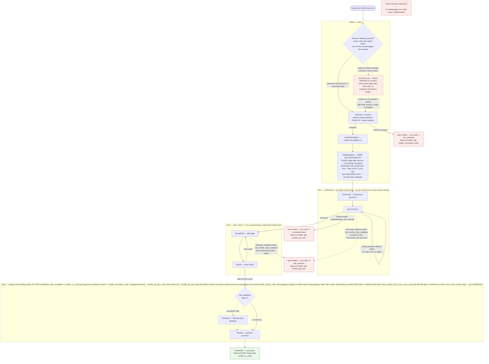
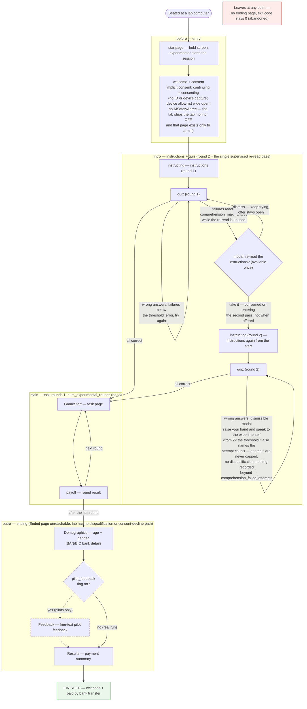

# oTree-Template

A ready-to-run oTree study: four apps (consent → instructions + quiz → task →
endings), a design system, recruitment plumbing for **a physical lab** and for
**Prolific**, and the guards that stop a live study breaking quietly. Copy it,
put your game in `main/`, run it.

## START HERE — which door is yours

Five documents exist and they are for different readers. Open the one that
matches what you are doing; you do not need the others yet.

| If you are… | Start with | It answers |
| --- | --- | --- |
| **running a study** built from this template | **[`docs/README.md`](docs/README.md)** | what to change, what to check before launch, how to look at your instructions, how participants get paid |
| **editing the template** (human or agent) | **[`CLAUDE.md`](CLAUDE.md)** | the rules that must not be broken, and why each one exists |
| **wondering why something odd is the way it is** | **[`DECISIONS.md`](DECISIONS.md)** | every decision with its reasoning, the rejected alternative, and where it is enforced — or the admission that nothing enforces it |
| **reading exported data** | **[`CODEBOOK.md`](CODEBOOK.md)** | every field, every exit code, and what a value does and does not mean |
| **writing a task, quiz, instructions or tests** | **[`docs/skills_claude/README.md`](docs/skills_claude/README.md)** | the authoring playbook for each of those jobs |

**This file** is the reference manual behind all of them: the repository layout,
the parameter scheme, the participant flow, the scripts, testing, Docker and
Prolific. Skim the layout table below, then read the section you need.

### If you are completely new, in this order

1. **Set up and run it** (below), then open `http://localhost:8000/demo` and click
   through a session. Nothing needs configuring first.
2. **[`docs/README.md`](docs/README.md)** — the three controls that decide
   everything a participant sees, and what to do before a real launch.
3. **"Parameter scheme"** below — the flags, and how a recruitment profile
   resolves into explicit config keys.
4. **[`docs/conventions.md`](docs/conventions.md)** — the design principles, if you are
   going to change code.
5. **[`CLAUDE.md`](CLAUDE.md)** — before your first edit. Short, and every rule
   in it shipped a real bug once.

## Setting up (once)

Python 3.9+ and one `pip install`. **Install only the group you need** — running
a study does not require the browser-test stack.

```bash
python3 -m venv .venv
source .venv/bin/activate            # Windows: .venv\Scripts\activate

# 1. RUN A STUDY — the only group most people need.
pip install otree==6.0.15
otree devserver                      # then http://localhost:8000/demo

# 2. PREVIEW THE INSTRUCTIONS without running a session
pip install jinja2 playwright
playwright install chromium          # only needed for the PDF; the HTML works without it

# 3. RUN THE TESTS (HTTP suites, and the measured render checks)
pip install requests pillow playwright
playwright install chromium

# 4. FORMAT EXPORTED DATA (scripts/format_session_data.py)
pip install pandas

# 5. RUN AGAINST POSTGRES outside Docker (the image already has it)
pip install psycopg2-binary==2.9.12
```

**Why these and no others.** `otree==6.0.15` brings SQLAlchemy, Starlette,
uvicorn and WTForms with it, so the study itself needs nothing else. The four
extra groups are tooling: `jinja2` for the preview generator, `playwright` +
`pillow` for the browser render checks, `requests` for the HTTP-driven test
suites, `pandas` for the one data-formatting script. `otree` and
`psycopg2-binary` are pinned to exactly what the `Dockerfile` installs, so local
and container agree; the tooling is left unpinned because it is not the study.

**One known noise:** installing `jinja2` upgrades `markupsafe` past the version
`otree==6.0.15` pins, and pip prints a dependency-conflict warning. It is a
warning, not a break — the full test suite passes with the upgraded package. If
you would rather keep pip quiet, install `jinja2==2.11.3`.

**Do NOT run `otree resetdb` first.** `otree devserver` creates its own database;
`resetdb` is for the deploy path (see Docker). Running `resetdb` and then
`devserver` on the same tree makes the server refuse to start with *"oTree has
been updated. Please delete your database (db.sqlite3)"* — `resetdb` writes the
tables without the sqlite `user_version` stamp that devserver's in-memory loader
checks, so it reads as a version mismatch. It is not one. **The fix is to delete
`db.sqlite3` and just run `otree devserver`.**

On a machine without root, headless Chromium needs nine unpacked system
libraries — the whole recipe is `docs/headless_chromium_recipe.md`.

## App Timeline
- before (welcome + consent; online: external-ID + device capture)
- intro (instructions + quiz; optional AI-safety arming page)
- main (experimental game; optional tab monitor + passive capture)
- outro (endings: normal / disqualified / no-consent; demographics + payment; optional pilot feedback)

## Repository layout
The project root holds the four oTree apps plus a small set of top-level items:

| Item | What it's for |
| --- | --- |
| `before/` `intro/` `main/` `outro/` | the four oTree apps, run in this order (see App Timeline). `intro/` also holds `generate_instructions_preview.py`. |
| `_static/` | shared CSS/JS/HTML/images (the design system and `template.html`). |
| `scripts/` | operational scripts: `start.sh`, `prelaunch_check.py` (config guard), `predeploy_check.sh`/`.py` (upgrade gate), `export_data.py`, `format_session_data.py`, `set_up_otree.bat`. |
| `scripts/tests/` | HTTP-driven flow tests, escaping/frozen-config regressions, and the browser render check (see "Testing"). |
| `scripts/site_previews/` | builds the six self-contained screen previews the academic website embeds, from the live template (`build_site_previews.py`), plus the measured check that they render uncut and at one shared scale (`check_site_previews.py`). Five are participant screens built from `bodies/`; the sixth is the experimenter monitor, which is rendered by the dashboard's own JavaScript over the invented session in `monitor_session.py` and then frozen, so that step needs Playwright. Output lands in gitignored `_ai/site_previews/`. Re-run after changing `_static/global/css/` — or, for the monitor, `experimenter_dashboard.py`. |
| `docs/` | **the tracked reference a copied study inherits** — start at `docs/README.md`. Hosting an online study, running one on Prolific, the design principles (`conventions.md`), the headless-Chromium recipe the render checks need, the open Postgres gaps, a group-matching reference implementation, and the experimenter-dashboard brief as it was specified. |
| `docs/skills_claude/` | authoring playbooks for an agent working ON the template: writing the task, instructions, quiz, tests, and the Railway hosting procedure. Index: `docs/skills_claude/README.md`. |
| `_templates/` | templates rendered OUTSIDE oTree's page system. Currently `room_welcome.html`, the styled room entry gate (see "The room welcome gate"). |
| `settings.py` | oTree settings: session configs, recruitment profiles, feature flags, completion codes. |
| `common.py` | shared, oTree-free helpers — **must stay at the project root** (every app does `import common`). |
| `identity.py` | participant-label identity: one row per external id, and the guard that stops a duplicate label 500-ing at entry. Also root-level, for the same reason. |
| `fee_guard.py` | the BOOT guard that refuses to start a build whose session configs (or app source) set oTree's built-in `participation_fee` to anything but 0. One payment ledger: see "Paying participants". Called from `before/__init__.py` beside the payoff guard. |
| `payoff_guard.py` | the BOOT guard that refuses to start a build whose app modules write oTree's per-round `player.payoff`. Called from `before/__init__.py`. It exists because the alternative — `AUTO_TABULATE_PAYOFFS=False` making oTree's setter raise — fires inside a participant's request, so on a live upgrade it is a dead page mid-round rather than a data error. Root-level for the same reason as the others. |
| `experimenter_dashboard.py` | the live operator view at `/experimenter_dashboard` (see "Experimenter dashboard"). Root-level for the same reason as the two above. |
| `README.md` `CLAUDE.md` `DECISIONS.md` `docs/conventions.md` `CODEBOOK.md` | the five documents in the START HERE table above: reference manual, rules for editors, decision record, design principles, data codebook. |
| `Preview_Instructions.command` | double-clickable (macOS): view the instructions as a coauthor would, with **no terminal** — see "Collaborating on the instructions flow". |
| `TODO.md` | pending work. **Gitignored — local only, not in a copy.** |
| `MACMINI_HOSTING.md` | private Mac mini hosting runbook (gitignored — kept local). |
| dotfiles | `.gitignore`, `.gitattributes`, etc. |

Not tracked in git: `_ai/` (agent scaffolding — pilot snapshots, performance reviews, audits), `previews/` (regenerable instruction previews), `TODO.md`, `MACMINI_HOSTING.md`, the SQLite DB, `__pycache__`, and OS cruft. Reference material a copied study genuinely needs is tracked in **`docs/`** instead — start at `docs/README.md` if you are running a study rather than editing the template.

## Running the template
It runs out of the box with no setup: `otree devserver` uses a local SQLite file,
and dev admin credentials default
to `admin`/`admin`. Set real values via env in production (`OTREE_ADMIN_USERNAME`,
`OTREE_ADMIN_PASSWORD`, `OTREE_SECRET_KEY`). `DEBUG` is derived by oTree
from `OTREE_PRODUCTION` — never hardcode it.

**The database backend is chosen by `DATABASE_URL` and nothing else.** Unset
means the local SQLite file. The `DB_NAME`/`DB_HOST` block in `settings.py`
*looks* like it selects Postgres and does not — oTree 6 dropped Django and never
reads `DATABASES`, so setting those gets you SQLite, silently. Recorded, with the
options for fixing it, in `docs/postgres_assumptions.md` (item 4).

## How to use and edit this template

An ordered walkthrough for starting a new study, for people and agents alike.
Each step names what to edit and links the `docs/skills_claude/` file that holds
the method — read the matching skill file **before** editing that surface.
The order matters: the game is built in `main` **before** `intro` is written,
because `intro` *describes* the game and describing before building is
backwards. (The shipped template has more Stag Hunt content in `intro` than in
`main` — that is an artefact of it being a placeholder that needed something
concrete to describe, not a pattern to copy.)

1. **Decide the audience and the recruitment settings** — lab or Prolific,
   chosen via the `recruitment` profile plus the module flags and (for
   Prolific) the completion codes; see the parameter scheme below. Then shape
   the entry pages: welcome + consent live in `before/welcome+consent.html`
   and `before/__init__.py` → [`docs/skills_claude/writing_welcome_consent.md`](docs/skills_claude/writing_welcome_consent.md).
   Treatment assignment: edit `before/treatment_assignment.py` — treatments
   are assigned when the session is created (via `creating_session` in the
   `before` app); adjust `assign_treatments` to set the treatment groups you
   need.
2. **Build the game in `main/`** — replace the placeholder task pages,
   subclassing `TaskPage` and keeping the machinery you inherit (round loop,
   progress strip, monitoring, payoff plumbing); update
   `scripts/tests/main_contract.py` in the same change
   → [`docs/skills_claude/writing_task.md`](docs/skills_claude/writing_task.md), the
   full manifest of everything a game swap touches.
3. **Write `intro` to match the game you built.**
   Instructions content: edit `intro/instructions_text.html` — each
   `<div class="instruction-block">` is shown as one page to participants;
   add, edit, or reorder blocks there to change the instruction pages
   → [`docs/skills_claude/writing_instructions.md`](docs/skills_claude/writing_instructions.md).
   Quiz questions: edit `intro/quiz_items.py` — define `QUIZ_ITEMS` entries
   with `field`, `prompt`, `choices`, and `answer`; the intro quiz reads
   directly from this file
   → [`docs/skills_claude/writing_quiz.md`](docs/skills_claude/writing_quiz.md).
4. **The `outro` work.** Experimental payoff: edit `outro/payment_rule.py` to
   determine how participants are actually paid — the logic inside this file
   controls which rounds and payoffs are selected for payment at the end.
   The Results receipt renders what `outro.compute_final_payoff` computes.
5. **Test what you built** — real HTTP, a no-JS submit, and a measured render
   check; before launch run `scripts/prelaunch_check.py` and
   `scripts/predeploy_check.sh`
   → [`docs/skills_claude/writing_tests.md`](docs/skills_claude/writing_tests.md) and
   the Testing section below.

### Rebranding a copied study (whose logos and whose university)

This template ships the CREED and University of Amsterdam marks as its
defaults. **If you are not us, changing them is two image files and one line.**

| What | Where | Note |
|---|---|---|
| Your lab / centre mark | `_static/global/images/lab_logo.jpg` | replace the file, keep the name |
| Your institution mark | `_static/global/images/university_logo.jpg` | replace the file, keep the name |
| Your institution's name **in prose** | `settings.INSTITUTION_NAME` | read by the consent page's privacy sentence |

Then bump `settings.STATIC_VERSION` and re-record the asset manifest
(`python scripts/prelaunch_check.py --stamp-assets`), as with any change under
`_static/`.

Three things worth knowing before you swap:

- **Both marks are sized by HEIGHT** (40px in the footer, 32px on a phone and
  on a short screen), so their widths follow their aspect ratios. The shipped
  marks are wide wordmarks; a tall, square mark will take much more width than
  the row can give it and the strip will wrap. See the `.logo-row` note in
  `base.css`.
- **`lab_logo.jpg` appears in two places** — the footer strip on every page
  where the institution speaks, and beside "Welcome to" on the lab gate
  (`before/startpage.html`). One file, both places, on purpose: it is what
  keeps the swap to two files. If you want a compact variant on the gate,
  point that one `` in `_static/global/html/welcome_header.html` at it and
  mark the departure.
- **The alt text is deliberately generic** ("University logo", "Research lab
  logo") rather than read from `INSTITUTION_NAME`, and that is not an
  oversight. The logo partials are also included by `_templates/room_welcome.html`,
  which oTree renders with a context of only `has_participant_label_file` — no
  session, no config, no `C` — so a constant referenced there would work on
  every participant page and break the room gate, which is the lab's front
  door. The institution is carried by the image; the name lives in settings for
  the places that can read it.

`INSTITUTION_NAME` carries its own article (`'the University of Amsterdam'`,
but `'MIT'`): the sentence using it cannot know which one your name takes.

## Parameter scheme (read `docs/conventions.md` and `settings.py` first)
Three **independent axes** at the top of `settings.py` determine everything a
participant experiences:

1. **Study type** — `recruitment`: `prolific` | `lab`. The recruitment
   plumbing, decided once per study:
   - `prolific` — external-ID capture, completion-code redirects, tab monitor,
     comprehension disqualification, passive + device capture. Paid on-platform.
   - `lab` — no Prolific plumbing, no tab monitor; collects bank details and
     demographics; supervised one-time quiz re-read instead of disqualification.
2. **DEBUG** — from the environment (`OTREE_PRODUCTION` unset → DEBUG on).
   Drives every dev affordance: skip controls, quiz solutions in the browser,
   and the `verify_quiz=False` clickthrough loosening (honoured **only** under
   DEBUG). Orthogonal to study type: a prolific-configured session under DEBUG
   still runs all its integrity modules.
3. **Pilot feedback form** — `pilot_feedback`: shows a free-text feedback page
   at the end. On for pilots/friend tests, off for the real run, regardless of
   the other two axes.

Everything optional is one **feature flag** in `SESSION_CONFIG_DEFAULTS`, shipped
**OFF**. The study-type profile is a named bundle of flag values that is
**resolved into explicit config keys at import**, so the admin session-config
view shows exactly what a session will run with. An explicit per-config flag
always overrides the profile. (There is no `testing` study type — clickthrough
loosenings belong to the DEBUG axis; see the `test` session config for the
pattern.)

Modules (all off by default): `prolific_capture_participant_id`, `prolific_completion_redirects`,
`tab_monitor`, `comprehension_dq`, `quiz_reread`, `passive_capture`,
`device_capture`, `collect_bank_details`,
`collect_demographics`, `pilot_feedback`. The one deliberate exception to
off-by-default is **`explicit_consent`** (the consent page asks an explicit
"I consent / I do not consent" question, declining routed to exit code -1):
it ships **ON**, because asking is the safer ethical footing and a study must
opt out — the lab profile resolves it OFF (implicit consent by continuing,
with an experimenter in the room). It is an ethics decision with its own flag,
not Prolific plumbing — see DECISIONS.md (2026-08-14). Thresholds (`comprehension_max_failures`,
`tab_monitor_*`) and Prolific codes (`prolific_cc_code`, `prolific_noconsent_code`, `prolific_dq_code`)
are config values too. Each participant records a numeric
`exit_code` (see `CODEBOOK.md`). `C.NUM_ROUNDS` is fixed at import — a config may
run fewer rounds, never more.

**`allowed_devices`** (the entry device allow-list) and **`prolific_screenout_return_url`**
(where a screened-out participant is sent, codeless) have their own reference
section — **[The device check](#the-device-check-what-it-inspects-and-what-it-cannot)**
— because the name promises more certainty than any User-Agent check can
deliver. Read it before narrowing the list.

Every participant field, exit code, stage timestamp and future-proofing spare
column is documented in **`CODEBOOK.md`** (including the repurpose convention for
spares: never rename in place).

## The device check: what it inspects, and what it cannot

`allowed_devices` is called a device check, and the name promises more than any
browser can deliver. This section is the reference for what it actually does, so
nobody has to read the classifier to find out.

### What it inspects

**The `User-Agent` header of the entry request. Nothing else.** It does **not**
measure screen size, viewport width, touch capability, battery, or anything else
that lives in the browser: the check runs server-side before the consent page
exists, and none of that has been sent yet. Two consequences, both deliberate:

- a **desktop browser in a narrow window is NOT screened out** (proved at 640px
  by `scripts/tests/render_check.py`, leg AE);
- a **phone held in landscape IS screened out**, because it is still a phone.

`device_capture` separately records what the client says about itself
(`is_mobile`, `device_type`, screen size) as **measurement**. It arrives later,
on the consent form, it can be edited by anyone, and it gates nothing.

### The four types

| Type | Means |
| --- | --- |
| `phone` | iPhone/iPod, Android with `Mobile`, Windows Phone, BlackBerry, Opera Mini… |
| `tablet` | iPad, Android without `Mobile`, Kindle/Silk, anything self-declaring `Tablet` |
| `computer` | **laptops AND desktops** — Windows, macOS, X11/Linux, Chrome OS, BSD |
| `unknown` | a real, readable User-Agent that matches none of the above |

**There is no `laptop` type and one cannot be added.** A browser does not expose
the form factor of a computer: neither the User-Agent nor the client hints
(`Sec-CH-UA-Mobile`, `Sec-CH-UA-Platform`, `navigator.userAgentData`)
distinguish a laptop from a tower, and battery, touch and screen size do not
either — a desktop can have a touch screen, a laptop can sit docked to a 27"
monitor with the lid shut. A study that truly needs "laptop only" has to ask the
participant.

### The fifth state, which is not a type

`unknown` means *we read a header and did not recognise it*. It is different
from **no decision at all**, which is what the code calls `UNDETERMINED`: no
request object (oTree instantiates pages without one while it walks the skip
chain), no `User-Agent`, an empty or whitespace-only one, one carrying
characters a header may not contain, one absurdly longer than any real browser
sends, or an exception anywhere in the classifier.

`UNDETERMINED` is never a member of `allowed_devices`, and the rule about it is
**asymmetric — this is the part that is easy to get backwards**:

- **on entry it ALWAYS allows**, and records nothing at all. The gate simply
  re-decides on the next real request. A false positive turns a real
  participant away; a miss costs one noisy row.
- **it NEVER clears an existing screen-out.** A stripped header is not evidence
  that somebody switched device. If it counted as one, anyone screened out
  could lift their own screen-out by sending no `User-Agent`, which takes
  seconds, and the check would be a suggestion.

Clearing therefore requires the detected type to be **explicitly in**
`allowed_devices` (`common.device_clears_screenout`), never "not rejected".

**`unknown` and `UNDETERMINED` are not interchangeable, and the whole safety
property rests on that.** `unknown` is a device type: a real header we could
read and did not recognise. If a study has LISTED `unknown` as allowed, an
`unknown` device *does* clear a screen-out — at that point it is positive
evidence of a device the study accepts, and refusing it would contradict the
allow-list. `UNDETERMINED` is not a device at all, is never in the list, and
never clears.

### The invariant (apply this to any device type you add)

> **The clear predicate must be exactly the entry-allow predicate minus
> `UNDETERMINED`.**

Nothing else is safe or coherent. If clear allows **more** than entry there is a
hole: somebody lifts a screen-out with a device that would not have been let in.
If clear allows **less** than entry, the page is telling somebody that switching
devices will work when for them it cannot — the mistake the implementation this
was adapted from made, where `unknown` never cleared even in a study that
admitted unknown devices. Their concrete victim: a laptop whose User-Agent is
stripped by a privacy tool or a corporate proxy classifies as unknown and is
admitted on a fresh visit, but if that person first opened the study on their
phone they are screened, and switching to that very laptop does not lift it —
while the page in front of them says to switch devices. Rare, and exactly the
person the soft wall exists for.

Ours cannot be exploited because of the property that is also the **test for any
new type**: *anything that clears could equally have entered fresh on that same
device*, so admitting it on the clear path takes nothing away from the gate. Add
a fifth type tomorrow and ask that question of it — if a participant arriving on
it for the first time would be let in, it must also lift an existing screen-out;
if it would not, it must not. `UNDETERMINED` is the single carve-out, because
"could they have entered fresh on it?" has no answer for a non-device, and
treating it as a clear would let anyone lift their own screen-out by sending no
header. The accepted cost, stated plainly: somebody screened on a phone who
switches to a laptop that sends no usable header stays screened, and their
remedy is the way off the page.

### The default, and two worked configs

Shipped: `allowed_devices=['phone', 'tablet', 'computer', 'unknown']` — every
type permitted, so **the check has no participant-visible effect whatsoever**
until a study opts in. It lives in the Prolific block but is *not* part of the
prolific profile bundle: choosing the prolific study type never narrows it.

```python
# Computers only — the common case for a study with charts or a wide table.
dict(name='prolific', recruitment='prolific', allowed_devices=['computer'], …)

# Phones turned away, tablets fine.
dict(name='prolific', recruitment='prolific',
     allowed_devices=['tablet', 'computer', 'unknown'], …)
```

A comma-separated string works too (`allowed_devices='computer'`). Unknown words
are dropped, and an empty list is treated as "no gate" rather than screening the
whole sample out.

### What happens to a screened-out participant (the soft wall)

They are **held on the consent page's own index** and served
`before/screened_out.html` instead of consent. They never see the consent
question, and they never advance into the study.

- **The verdict is written immediately**, at decision time: exit code `-4`,
  `screenout_active=True`, and the detected type as the cause. Somebody who reads
  the page and closes the tab still exports as a screen-out, not an abandoner.
- **It clears if they come back on an accepted device before consent.** The exit
  code goes back to `0`, `screenout_cleared` is set to `True` for good, and every
  verdict is appended to `participant_extra['screenout_history']`. They then do
  the study as an ordinary participant. Each value is reverted only if it still
  holds what the screen-out put there, so a clear cannot clobber another
  mechanism's record.
- **Accepted consequence:** the exit code is therefore no longer write-once. An
  export taken while somebody is mid-switch shows a `-4` that later changes;
  `screenout_cleared` and the history are how you tell those rows apart.
- **After consent the check never applies again** — not to a participant who
  switches to a phone mid-study, and not to anyone already running when a deploy
  turns it on. The boundary is the durable `consent_submitted` flag, never a
  page index.
- **The way out carries NO completion code.** The button is a plain link to
  `prolific_screenout_return_url` (the Prolific participant site). A completion code
  would close their submission the moment they clicked, and a returned
  submission can never be retaken — which forecloses the outcome the page is
  asking for. There is deliberately no screened-out completion code, and none
  must be added to the pre-launch required-codes guard. It is a real `<a href>`,
  not a scripted button, so it works with JavaScript disabled.
- **Re-entry depends on the participant label.** On a real Prolific link the id
  arrives in the URL at entry, so a returning participant is rematched to the
  same row. Somebody who was screened out after entering on a **bare link** has
  no label, so nothing can rematch them and they get a fresh row on their next
  visit. That is acceptable and visible in the data — see also *Rebinding a room
  mid-study* below.

### The limits, stated plainly

- **User-Agent strings can be spoofed** by anyone who wants to. This stops
  *accidental* entry on the wrong device; it does not stop determined
  circumvention, and it is not a security control.
- **Classification is pattern-matching** against strings that change as new
  devices ship, so it will drift. Review the patterns in `common.py`
  occasionally, and treat `unknown` verdicts in the export as the signal that it
  is time.
- **Prolific's own device restrictions are advisory** — they filter who is shown
  the study, not who can open the link. That is why this exists in app code at
  all.

### What is actually verified (and where)

Run these against a server on a **throwaway** database. The weighting is
deliberate: most of the checks exist to prove that people are **not** screened
out.

| Test | What it proves |
| --- | --- |
| `scripts/tests/device_gate_test.py` §A1–A2 | desktop Chrome, Safari, Firefox, Edge, Chrome OS, a touchscreen Windows laptop, an iPad and an Android tablet are **never** screened — under the shipped list, and under a computers-only list |
| `scripts/tests/device_gate_test.py` §A3 | a missing, empty, whitespace-only, absurdly long, or "long and says iPhone" User-Agent proceeds to consent with **no verdict recorded** |
| `scripts/tests/device_gate_test.py` §A3b | control-character/`None`/non-string values classify as `UNDETERMINED` (uvicorn rejects control-character headers before app code, so there is no HTTP leg for that one) |
| `scripts/tests/device_gate_test.py` §B–C | an excluded type never sees consent, gets exit `-4` with the DETECTED type as its cause and copy written for that type; any type can be excluded; `unknown` is configurable like the rest |
| `scripts/tests/screenout_softwall_test.py` §1–4 | verdict written immediately (closed tab still exports `-4`); cleared on returning from an accepted device with **both** verdicts in the history; re-screened on going back; a cleared participant completes as an ordinary `exit_code=1` |
| `scripts/tests/screenout_softwall_test.py` §5 | a participant who consented on a computer and then switches to a phone is **never** touched, whatever the allow-list says |
| `scripts/tests/screenout_softwall_test.py` §6–7 | the way out is a real `<a href>` with no completion code and no `onclick`; re-entry after pressing it does not silently revive the row |
| `scripts/tests/screenout_softwall_test.py` §8 | the asymmetry, both directions, side by side: the same unusable header allows a fresh participant and does **not** clear an already-screened one |
| `scripts/tests/identity_test.py` | one row per id across re-entry, two tabs and case/whitespace variants; a clashing id claim is refused silently; a duplicate label that exists anyway does not 500; a rebound room orphans people |
| `scripts/tests/render_check.py` leg L, AD | the screen-out page's copy and its two unequal paths; the way out measured **with JavaScript disabled** (present, visible, pressable, secondary) |
| `scripts/tests/render_check.py` leg AE | a 640px-wide **desktop** window still reaches consent — width screens nobody out |

## The room welcome gate

oTree 6 serves an interstitial on every room entry — a GET on `/room/<name>`
without `welcome_page_ok=1` — that oTree 5 had no equivalent of. Stock it is bare
framework markup, and it is the FIRST thing a participant sees. This template
ships a styled copy at `_templates/room_welcome.html`, wired through
`welcome_page` on the `ROOMS` entry in `settings.py`.

It also **auto-passes anyone whose URL already identifies them** — a lab seat link
or a Prolific arrival (`?participant_label=…` or `?PROLIFIC_PID=…`) flows straight
through to the study and never perceives the page. Three properties are
load-bearing and must not be traded away:

- **A bare URL still shows the button, and no slot is claimed without a click.**
  That is what keeps bots out: they arrive with no id and usually run no
  JavaScript.
- **`form.requestSubmit()`, never `form.submit()`.** `submit()` does not fire
  submit-event listeners, so it would bypass oTree's own gate handler and — in
  any study with a participant-labels file — loop the page forever, for
  id-carrying arrivals only, which is to say for real participants and never
  while you test with a bare URL.
- **A loop guard**: auto-pass fires at most once per tab, so a failure leaves a
  clickable button rather than a participant who never arrives and leaves no
  trace.

With JavaScript disabled the gate cannot be passed at all — oTree's handler *is*
the mechanism — so the page says so plainly. Behaviour is covered end to end by
`scripts/tests/room_gate_test.py` (id present, bare URL, the loop guard in the config
where the loop is real, and the no-session lab prep flow); the look is measured by
`scripts/tests/render_check.py` leg AR.

## Rebinding a room mid-study orphans participants

**Operational rule, not a bug we can fix.** oTree matches a participant label
**within a session** (`session.pp_set`), so the moment a room is bound to a NEW
session, anybody mid-study in the old one can no longer be rematched: their next
visit lands on a fresh row in the new session and they start again, while their
old row keeps their data and their id.

So: **never rebind the room while participants are running.** `scripts/start.sh`
deliberately reuses a room's already-bound session for this reason. If you must
create a new session, treat everyone in the old one as finished, and expect
duplicate ids **across** sessions (which is fine — the constraint is per
session). Pinned by `scripts/tests/identity_test.py` §6.

## Duplicate participant labels

oTree resolves a returning participant by label, and its lookup calls `.one()`:
**two rows sharing a label is an uncaught `MultipleResultsFound` — a 500 at the
front door, for the id's real owner, permanently.** Re-entry is that lookup, and
so is the device screen-out's soft wall, so this template defends it twice
(`identity.py`):

1. **It refuses to create one.** Every label write goes through
   `identity.claim_label`, which will not stamp a label another row in the
   session already holds. The participant is not blocked and is told nothing;
   the owning row's code lands in `before.Player.prolific_label_conflict` for
   payment triage.
2. **It survives one that exists anyway** — a hand-edited row, a legacy
   database. oTree's lookup is patched to match labels **in Python, with the
   same normalisation conflict detection uses** (whitespace-collapsed,
   case-folded), so `ABC123` rejoins the row holding `abc123` and the answer
   cannot change with the database collation — oTree's own `filter_by(label=…)`
   is SQL, and would behave one way on sqlite and another on postgres. Among the
   rows that match, it joins **the earliest that has not FINISHED** (a finished row is a dead end to join; a *screened-out* row is
   terminal but must stay joinable, because joining it is what lifts the
   screen-out). When it actually sees a duplicate it is **loud**: an ERROR line
   in the server log naming every row, and a `duplicate_label_seen` record on
   the joined participant. An ordinary lookup records nothing.

**If the server refuses to boot with a `RuntimeError` from
`identity.assert_duplicate_label_guard`, oTree has drifted** — its entry lookup
has been renamed, moved, or has a different signature. That is deliberate: the
guard is asserted once, at app import, where a failure costs a boot rather than
a participant's page. Re-point `identity.py` at the new lookup; do not delete
the assertion. (The *early* install from `settings.py` is expected to fail
harmlessly — oTree's views are not importable that early — and never raises.)

## Participant flow by study type

The two charts below are derived from the actual page sequences and
`is_displayed` gates (`before`, `intro`, `main`, `outro`) and the
`settings.EXIT_CODES` table. Dashed nodes/edges are **flag-dependent** (the
pilot feedback page appears only when `pilot_feedback` is on); everything else
is always part of that study type. The charts are laid out identically so the
lab/prolific differences stand out: entry (hold screen vs consent question),
the quiz-failure rule (supervised re-read vs disqualification), the tab
monitor, and the ending (bank details + demographics vs completion codes).

### Prolific



| Exit code | Terminal state | Ending the participant sees | Completion code |
|----------:|----------------|-----------------------------|-----------------|
| `1` finished | Completed the study | `outro` Results → "Back to Prolific" | `prolific_cc_code` |
| `0` abandoned | Closed the tab, never reached the end | none (handled by Prolific as timed-out/returned) | none |
| `-1` no_consent | Declined consent at entry | `outro` Ended → "Back to Prolific" | `prolific_noconsent_code` |
| `-2` comprehension | Failed the quiz `comprehension_max_failures` times | `outro` Ended → "Back to Prolific" | `prolific_dq_code` |
| `-3` tab_monitor | Tab-away violations reached the cap | `outro` Ended → "Back to Prolific" | `prolific_dq_code` |
| `-4` screened_out | Device stopped by the entry allow-list (only when `allowed_devices` is narrowed) | `before` screened_out, in place of consent and their FIRST page — a plain link back to Prolific | **none, deliberately** ([why](#the-device-check-what-it-inspects-and-what-it-cannot)) |

> **The table above is the whole table:** every code in `settings.EXIT_CODES` is
> set by real code and appears here (`CODEBOOK.md` names the line that sets
> each). A reserved-but-unwired code is a lie in the export, so it gets deleted
> rather than documented — one such code, `-5`, was removed on those grounds.

### Lab



| Exit code | Terminal state | Ending the participant sees | Completion code |
|----------:|----------------|-----------------------------|-----------------|
| `1` finished | Completed the study | `outro` Results (payment summary; paid by bank transfer) | n/a (no redirects in lab) |
| `0` abandoned | Left the session | none — `comprehension_failed_attempts` and the stage timestamps are the experimenter's record | n/a |

`-1`/`-2`/`-3` cannot occur in lab: consent is implicit, and **the integrity
modules (`comprehension_dq`, `tab_monitor`) are not supported in a lab session**
— `scripts/prelaunch_check.py` FAILS on a lab config that turns either on. The
reason is conceptual: in the lab, a participant who does not consent or does not
pass the comprehension check simply cannot do the study, and that essentially
never happens because people know what they signed up for when they come to the
lab. The mechanical consequence, which is why it is a hard gate, is that a
disqualified participant is not a completer, so they skip the bank-details page
and the payment summary and are stranded at the machine. The lab's comprehension
rule is the re-read pass plus the "raise your hand" notice; a failed lab
participant is identified at analysis time by
`comprehension_failed_attempts >= comprehension_max_failures` (see `CODEBOOK.md`).
`-4` cannot occur either unless you narrow `allowed_devices` on the config — it
permits every device type by default in every profile, and a lab session's
computers would pass anyway.


## Collaborating on the instructions flow with others?
You can share the instructions with coauthors who don't have the codebase installed.

**No terminal? Double-click `Preview_Instructions.command`** (macOS). It picks a
Python, checks the two packages the generator needs, runs it against saved
settings if you have them, and opens the interactive preview in your browser. It
drives the maintained generator in `intro/` — never the stale copy that the
regenerable `previews/` output directory may also contain.

Otherwise the generator lives in the intro app it previews: run `python3 intro/generate_instructions_preview.py` (from the project root) to produce three self-contained files in a gitignored `previews/` output dir it creates on demand: a long stacked HTML (every block on one page), an interactive single-page HTML (one block at a time, with a floating treatment switcher), and a PDF rendition. All three are fully self-contained — no external dependencies, no internet — so you can email them or drop them into a doc and they'll render the same anywhere. The interactive HTML lets coauthors click through the instructions exactly as participants would and flip between treatments live via the corner buttons; the PDF is good for printing or marking up on paper. The generated files are regenerable and never tracked in git.

## Pages by app (edit guidance)
- before
  - `before/startpage.html`: waiting page while participants take a seat; experimenter must move participants beyond; usually leave as-is unless you need different holding text.
  - `before/welcome+consent.html`: welcome and consent; should be edited to match your approved consent language.
- intro
  - `intro/instructions_text.html`: only file to edit for instructions; each `<div class="instruction-block">` you add here is displayed as its own page automatically.
  - `intro/quiz_items.py`: edit questions, choices, and correct answers; updates flow into the quiz automatically.
  - `intro/templates/` (`instructing.html`, `quiz.html`): template shells; typically do not edit.
- main
  - `main/`: This folder contains the core logic and code for your experimental task. Place the main game code, task logic, and any files that control the experiment's core flow here.
- outro
  - `outro/Results.html`: built-in results summary showing per-round payoffs and total payment; generally leave untouched. To update how payment is calculated, edit the function in `outro/payment_rule.py`.
  - `outro/Demographics.html`: collects and verifies IBAN numbers and other basic demographic questions; edit here if you need to change the questionnaire.

## Scripts (`scripts/`)
- `scripts/start.sh` : bind a session to the lab room on boot, **reusing** an
  already-bound session instead of creating a new one each time (which would
  strand in-progress participants). Authenticates REST calls with
  `OTREE_REST_KEY` when `OTREE_AUTH_LEVEL=STUDY`; fails loudly rather than
  leaving the room unbound.
- `scripts/prelaunch_check.py` : the machine-checked **pre-launch** guard as a
  standalone command (non-zero exit on any testing/placeholder value). Run it in
  the target environment, e.g. `OTREE_PRODUCTION=1 python scripts/prelaunch_check.py`.
- `scripts/predeploy_check.sh` (+ `predeploy_check.py`) : the **pre-deploy
  upgrade** gate. Boots the candidate build against a *copy* of the live database
  and drives real participants over real HTTP. See "Before a deploy" below.
- `scripts/export_data.py` : downloads `/ExportWide` and `/ExportPageTimes` over
  an authenticated admin HTTP session. NB: exporting against a database whose
  schema predates the running code returns HTTP 500 — the script says so
  explicitly instead of writing a truncated file.
- `scripts/format_session_data.py` : turns raw SENSITIVE data into i) csv for
  payment, ii) csv with anonymised experiment data, and iii) optionally a draft
  email with the anonymised file attached (recipient configurable via `--email`
  or `$SESSION_DATA_EMAIL`).
- `scripts/set_up_otree.bat` : starts oTree on the experimenter's Windows PC in
  the lab.
- `scripts/tests/` : HTTP-driven flow tests, escaping and frozen-config regression
  tests, and a measured browser render check (see "Testing" below).

> **`common.py` stays at the project root** — it is *not* in `scripts/`. All four
> apps do a top-level `import common`, and oTree puts the project root (not
> `scripts/`) on `sys.path`, so moving it would break every app's import.

## Paying participants — the itemisation rule

> **ONE LEDGER.** Everything a participant is owed ends in `participant.payoff`,
> written once by `outro.compute_final_payoff`. Two boot guards hold that:
> `payoff_guard.py` refuses a build that writes oTree's per-round
> `player.payoff`, and `fee_guard.py` refuses one that sets oTree's built-in
> `participation_fee` to anything but 0 — oTree adds that fee ON TOP of
> `participant.payoff` on the admin Payments page, so a non-zero value splits
> what you owe across two numbers, and it never reaches the CSV export at all.
> **A study copied from here that already sets a fee will refuse to boot until
> the money is moved into the ledger** (into `showup`, or into `earned`). That
> cost is deliberate — see `DECISIONS.md`.

> **ANY PAYMENT COMPONENT PAID OUTSIDE OTREE MUST STILL BE REPRESENTED INSIDE
> OTREE, OR THE ADMIN PAYMENTS PAGE BECOMES A PARTIAL FIGURE THAT LOOKS LIKE A
> TOTAL.**
>
> **Corollary — on Prolific the components are paid by DIFFERENT MECHANISMS**
> (the base as the study reward, the bonus through the bonus payment flow), so
> the total alone is not enough: **the bonus must be separately visible**, and
> it is the number that has to survive intact.

Raised by the exp_pilots bossman (2026-08-14). The failure has two shapes and
they look like opposites, which is why one rule covers both:

- **Complete but not itemised** — every component is inside oTree and the total
  is right, but the admin Payments page shows one undifferentiated number. It is
  correct and **not actionable**: whoever pays the Prolific bonus cannot read the
  bonus off it. *This is the shape this template is in today.*
- **Itemised but incomplete** — the components are separate, but one of them (a
  base paid on the platform) never entered oTree at all, so the "total" is a
  partial figure wearing a total's name.

Neither has the property that matters, which is **itemisation of a complete
set**. What this template records per participant, all of it inside oTree:

| Figure | Where it lives | Paid on Prolific as |
| --- | --- | --- |
| base / show-up fee | `showup` in the session config; rendered on the receipt as **Base payment** | study reward |
| decision bonus | `outro.Player.selected_sum` (the `num_rewarded` selected rounds) | bonus payment |
| quiz bonus | `outro.Player.quiz_bonus_awarded` | bonus payment |
| **total** | `outro.Player.earned`, mirrored once into `participant.payoff` | — |

The three components reconstruct `earned` exactly, with no residue, and the
export carries `player.selected_sum`, `player.quiz_bonus_awarded` and
`player.earned` as their own columns — so **the bonus figure is recoverable
today from the export**, even though the admin Payments page shows only the
total. The participant's own receipt already itemises; the gap is on the
payer's side.

**Pinned by** `scripts/tests/payoff_ledger_test.py` §9, which walks a *prolific*
session and asserts the bonus in isolation as well as the total — because a
study can get the total right while making the actionable number unreadable,
and a test that only checks the total will not notice. §9 also records the
current admin-page state as a measured gap; if the bonus is ever surfaced
there, that check is expected to go red and should be rewritten to assert the
new behaviour.

Whether `participation_fee` should carry the base (so oTree itself splits
reward from bonus) is an **open decision** — it changes what the exported
columns mean, so nothing has been changed yet.

## Experimenter dashboard

A live, **read-only** view of a running session for whoever is supervising it —
the experimenter in the room for a lab session, whoever is watching the study run
on Prolific. It is served **in-process** by oTree itself
(`experimenter_dashboard.py`, design notes in `_ai/dashboard_notes.md` — local only — `_ai/` is gitignored; not in a clone), not as a
separate service:

- `/experimenter_dashboard` — pick a session;
- `/experimenter_dashboard/<session_code>` — the dashboard.

One row per participant, keyed on `participant.label` (the seat number in the lab,
the Prolific ID online; the participant code, dimmed, until a label exists). Each
row carries a six-step timeline — **Entry → Instructions → Quiz → Task →
Questionnaire → Done** — with the marker on the current step, carrying the round
number ("2 of 10") while they are in the task. Then the quiz-attempts cell (white
→ filling → red at `comprehension_max_failures` → green with the attempt count
once passed, so `1` means passed first time), time on the instructions, earnings
once known, and a state cell. A terminal state **overrides the marker** with an
emoji at the step the participant had reached: 📵 screened out, ✋ declined
consent, ❌ comprehension DQ, 👀 tab-monitor DQ. A row turns **amber** after too
long on one page, and rows that never arrived are dimmed with a header toggle to
hide them. It repaints on a poll with a **2-second floor**.

**Access is oTree's own admin login, which means it is exactly as protected as
`OTREE_AUTH_LEVEL` makes it.** The dashboard reuses `AdminView`'s login check
rather than inventing one (and is deliberately stricter than oTree in one respect:
it also requires a login under `AUTH_LEVEL=DEMO`, which leaves oTree's own
SessionMonitor open). With `OTREE_AUTH_LEVEL` **unset** there is no login on any
admin page, this one included — so `scripts/prelaunch_check.py` fails a launch
that has not set it to `STUDY`. This page shows earnings and per-participant
conduct; treat it like the data exports.

**The settings, all read at request time** (so tuning them needs only a server
restart, and deleting any line falls back to the same default). They are
module-level settings rather than session-config parameters on purpose:
operator-screen behaviour must not appear in the admin's session-config view or
in the experimental record.

**The amber threshold is PER PHASE**, because "too long" on the consent page and
"too long" reading the instructions differ by an order of magnitude and one
number could not be right for both — set it low enough for entry and every
reader turns amber; high enough for the instructions and nobody stuck at entry
is ever flagged. Both failures are silent, and the operator simply learns to
ignore the colour.

| setting | default | governs |
|---|---|---|
| `DASHBOARD_STALL_SECONDS_BEFORE` | 60 | the entry block (startpage, consent, ID, AI-safety) |
| `DASHBOARD_STALL_SECONDS_INTRO` | 480 | the whole `intro` app — instructions and quiz share one |
| `DASHBOARD_STALL_SECONDS_TASK` | 180 | ONE task round (raise it for a longer task page) |
| `DASHBOARD_STALL_SECONDS_OUTRO` | 300 | the outro, before being marked complete |
| `DASHBOARD_STALL_SECONDS_DEFAULT` | 300 | any phase not named above |
| `DASHBOARD_POLL_SECONDS` | 2 | poll interval; 2 is also a floor, enforced server-side |

The thresholds in force are **shown on the page itself**: the ⓘ in the **State**
column header lists all four, read from these settings on every poll, so an
operator can see what counts as too long without opening `settings.py`. An amber
row additionally names the limit it tripped.

**The summary pills at the foot each state their POPULATION**, and it differs
from one to the next: **avg intro time** over everyone who has *completed the
intro* (whatever they are doing now — a participant in round 4 finished the intro
long ago, so their measurement is complete), and **avg earnings** over *finished*
participants only, because `earned` does not exist until the results page
computes it. A still-running intro timer is excluded from the first: averaging a
number that is still going up would move the mean every two seconds.

A third pill, **total payments**, sums the *same* `earned` figure the rows show,
over that same *finished* population (`of N finished`), so the one dashboard tab
carries the payment picture and nobody has to open oTree's own Payments page. It
is computed **server-side** from the same earnings read the row cells come from —
not re-added in the browser — so the strip total can never disagree with the
column it totals. Its mean is not repeated on it: the `avg earnings` pill beside
it already shows exactly that. There is no `participation_fee` line — the
template keeps that fee at zero (one payment ledger; see the fee guard).

**Adding a column** is three marked places and nothing else — compute the value
in `_participant_row` (`ADD A COLUMN HERE`), add a `<th>` to `_COLGROUP_HTML`,
add the cell branch in `renderRow` (`ADD A COLUMN HERE (render)`). **Adding an
APP** to a study copied from this template means adding it to `APP_STEPS`, which
is the map deciding where a new app's pages sit on the timeline; a participant in
an app that is not in that map is shown as `⁉️ app "x" not on the timeline` with
no marker, rather than being silently placed at Entry.

## Testing

There are several kinds of check here, and that is deliberate: each one is
evidence about a different thing, and each is blind to what the others see.
**Bots are not on the list.** `otree test` bots submit through the Python API —
they never issue an HTTP POST, never render a page, never leave a
JavaScript-filled field empty and never carry a User-Agent, and three live
outages in the pilot study this template was distilled from went green under
bots while real participants got a 500. Everything below drives the real thing.

Writing a new one: read **`docs/skills_claude/writing_tests.md`** first — it teaches
the method (drivers, the no-JS submit, visible-text assertions, escaping, frozen
configs, browser rendering checks) rather than just listing these files.

| Check | What it is evidence of | What it CANNOT catch | When to run it |
|---|---|---|---|
| **`scripts/tests/room_gate_test.py`** — the room welcome gate in a real browser: id present, bare URL, the loop guard, and the no-session lab prep flow | that an identified arrival flows straight through, that a bare URL still needs a click, and that a failing gate leaves a clickable button instead of looping | anything past the gate | after any change to `_templates/room_welcome.html` or the `ROOMS` wiring |
| **`scripts/tests/tab_monitor_detail_test.py`** — per-event tab-monitor detail and the at-least drop evidence | that a focus loss records the SERVER's page name (not the client's), that `tab_monitor_where` names pages, and that a client count BEHIND ours is never recorded as a loss | anything the client never sends — see CODEBOOK on what a clean row does and does not mean | after any change to `common._apply_focus_loss` |
| **`scripts/tests/full_journey_test.py`** — ONE participant, **room entry to the final page**, over real HTTP, at the config's **real round count**, **failing the quiz once** on the way. **NEVER TRIM OR DELETE THIS** (the file says why) | **that a participant can actually FINISH**: every screen in the real order, every round walked, the failed-attempt retry path, and `exit_code == 1` read back over the REST API | rendering; anything that only breaks for an EXISTING participant; the configs and edge cases the slice suites cover | before any launch, and after any change to the page sequence, the quiz rule or the round count |
| **`scripts/tests/http_flow_test.py`** — walks every shipped config entry→ending over real HTTP, including a POST with the JS-produced hidden fields deliberately **empty** | a participant can complete the study in each config; no page 5xxs; the no-JS participant is not stranded | anything about how a page looks or reads; anything that only breaks for an EXISTING participant. **It cannot tell finishing from being thrown out** — its end markers ("Back to Prolific", "participation has ended") are on `Ended.html` as well as `Results.html`; that is what `full_journey_test.py` is for | after any change to a page, form field or flow |
| **`scripts/tests/gated_flow_test.py`** — lab vs Prolific scenarios: the one-time re-read offer, comprehension DQ, pilot feedback, the two-variant consent rule | the three orthogonal controls actually route people where the design says | rendering; data written to the export | after touching `settings.py` profiles, gates, or the intro/outro flow |
| **`scripts/tests/device_gate_test.py`** — the entry allow-list, weighted towards FALSE POSITIVES: eleven real browsers (desktop Chrome/Safari/Firefox/Edge, Chrome OS, a touchscreen laptop, an iPad, an Android tablet, phones) plus every shape of unusable User-Agent | the listed types are admitted and nothing else is screened by accident: those browsers are never removed, an unusable User-Agent always proceeds recording nothing, an excluded type gets `-4` with the DETECTED type as its cause, and the default list does nothing at all | client-side behaviour; anything past entry | after touching the entry gate, the classifier or `allowed_devices` |
| **`scripts/tests/screenout_softwall_test.py`** — the screen-out lifecycle over real HTTP: screened → cleared → re-screened → completes, the post-consent immunity, the way out, and the no-decision asymmetry | the verdict is written immediately (a closed tab still exports `-4`), clears only on POSITIVE evidence of an accepted device before consent, never touches anyone after consent, and the way out is a codeless real link | rendering; anything a browser does with the page | after touching the gate, the clear rules or the screen-out page |
| **`scripts/tests/identity_test.py`** — in-process: re-entry, two tabs on one id, case/whitespace variants, a clashing id claim, a PLANTED duplicate label, and a room rebound to a new session | one participant row per id (which is what re-entry and the soft wall depend on); a clashing claim is refused silently with the owner's code recorded; a duplicate that exists anyway does not 500 | anything about the pages themselves | after touching label writes, `identity.py` or the entry sequence |
| **`scripts/tests/dashboard_test.py`** — in-process, production + `AUTH_LEVEL=STUDY`: the install discipline, the two dashboard acceptance criteria, row truth for every stage and all four terminal states, the entry-block boundary, an unmapped app, and read-only | that the dashboard is **unreachable without an admin login** (page, data and index, for an anonymous client AND for a mid-study participant's own cookies; the redirect leaks nothing; POST is 405); that a raising handler yields the **error panel** and `ok:false` JSON rather than a 500, and one poisoned ROW leaves the table `ok:true` with every other row live; that it **writes nothing** (byte-identical participant rows plus an ORM dirty-flag check); that an app missing from `APP_STEPS` is visibly unplaced instead of silently at Entry | **it is NOT proof that the wrapper is what protects participants.** Section C's participant walks are a regression guard: participant survival rests partly on oTree's `NEW_IDMAP_EACH_REQUEST` giving every request a fresh DB session, and those checks still pass with the wrapper deleted (check C0 pins that oTree property so a future version changing it goes red). The checks that fail when the wrapper is removed are the error-panel ones. Also blind to: anything about how the page LOOKS, and concurrency — the polls here are sequential | after touching `experimenter_dashboard.py`, the entry-block stamps, or any app's `page_sequence`/app list |
| **`scripts/tests/dashboard_render_check.py`** — real uvicorn + real headless Chromium at 1280/1512/1152, staging 13 participants across every state | that the operator screen is actually USABLE: the login wall stands in a browser, the poll paints and ticks without a reload, the six timeline steps are **measured** equal to within 2px, the mid-task marker reads "2 of 3", the amber row differs in sampled PIXELS rather than by class, entry-only rows dim and the toggle hides them, no horizontal page scroll, and no time/earnings/stall cell is ever clipped | server-side correctness (that is `dashboard_test.py`'s job); whether the numbers are RIGHT — it checks that cells render legibly, not that they say the truth; anything about a real operator's screen size or emoji font | after ANY change to the dashboard's HTML, CSS or JS — a broken operator layout produces no error anywhere |
| **`scripts/tests/xss_escaping_test.py`** — hostile participant- and URL-supplied values through the real entry URL, in production mode | every hand-interpolated value is HTML-escaped (oTree's ibis does **not** auto-escape) and round-trips un-truncated | injection through anything you did not render in the walk | after adding any template that prints a participant- or URL-supplied value |
| **`scripts/tests/frozen_config_test.py`** — deletes parameters from a created session's stored config, then walks it | a session created BEFORE a parameter existed still completes; `common.cfg` falls back to the shipped default | a schema change (that needs a real database copy — see the pre-deploy gate) | whenever you add a session-config parameter (and add its name to the test's `STRIPPED` list) |
| **`scripts/tests/render_check.py`** — real headless Chromium at three viewports; screenshots to `_ai/render_check/` (gitignored; the run creates it), assertions on measured element geometry and on rendered pixels | the pages are actually laid out, visible, scrollable and clickable — the failures that produce no error at all | data correctness; anything server-side | after any CSS or template-structure change |
| **`scripts/tests/render_check.py --diff`** — the same run, compared against the committed baseline `scripts/tests/geometry_baseline.json` (±3px) | a layout **regression**: something that still passes every threshold but MOVED (the Next button 40px up, a band narrowing, an eyebrow drifting). Prints page · viewport · element, old → new and the delta | anything the baseline deliberately excludes — page text, colours, pixel-darkness readings, content-random figures (all listed at the top of the baseline file) | before shipping a CSS/template change. **When the movement is INTENTIONAL, adopt it with `python scripts/tests/render_check.py --update-baseline` and let the file's own diff be the record of what moved.** |
| **`scripts/tests/example_quiz_content_test.py`** — **an EXAMPLE to copy**, not a suite member | what a page SAYS (prompts and options reach the participant, in order; answers absent in production) | anything you did not assert — content tests are only as good as their list | write your study's own version when you write your quiz |
| **`scripts/prelaunch_check.py`** — static config guard, no server, instant | the configuration is safe to open to participants: no `REPLACE_*` completion codes, `DEBUG` off, no testing loosenings left on | anything dynamic — it never runs a page | in the target environment, before opening a study |
| **`scripts/predeploy_check.sh`** — boots the candidate build against a **copy of the live database** and drives real participants | the *upgrade* is safe: an existing mid-flow participant, a fresh one and a no-JS one all survive the new code | placeholder codes and other configuration problems | before every deploy onto a database that has participants |

**The pre-deploy upgrade check is SKIPPED when there is no database.** Run with
no argument it reports the upgrade-path legs as **NOT TESTED** (never PASS) and
prints `THE UPGRADE PATH WAS NOT TESTED` in a banner. For this template, which
has no live data, that is expected and correct. **It must never be treated as a
pass for a study that has live sessions** — a fresh database is structurally
incapable of reproducing the failures the gate exists for. Pass `--require-db`
(or `PREDEPLOY_REQUIRE_DB=1`) in any pipeline for a study with participants, so
a missing database copy fails the deploy instead of quietly passing degraded.

Running them: the HTTP suites (`full_journey_test`, `http_flow_test`,
`gated_flow_test`, `device_gate_test`, `screenout_softwall_test`) want a server
you started on a **throwaway** database (`OTREE_ADMIN_PASSWORD=admin otree devserver 8000`, then
`python scripts/tests/http_flow_test.py http://localhost:8000`). The rest
(`identity_test`, `frozen_config_test`, `xss_escaping_test`,
`quiz_attempt_log_test`) boot oTree in-process against their own temp database
and need no server — `python scripts/tests/frozen_config_test.py`. `render_check.py` needs a headless
Chromium; on a box without root see `docs/headless_chromium_recipe.md`.

### Two gates: pre-launch and pre-deploy (they check different things)

|  | `scripts/prelaunch_check.py` | `scripts/predeploy_check.sh` |
|---|---|---|
| **Asks** | is this *configuration* safe to launch? | will the *running study* survive being upgraded to this code? |
| **Kind** | static, config only, no server, instant | dynamic: boots a real `otree prodserver` and drives real HTTP |
| **Catches** | `REPLACE_*` completion codes, `DEBUG` still on, `verify_quiz=False` left in | a page that 500s for a participant whose state predates the new code; a missing DB column; a page that 500s with JS-produced hidden fields empty |
| **Run it** | in the target environment, before opening a study to participants | before every deploy that lands on a database with participants in it |

Neither replaces the other: pre-launch cannot detect a broken upgrade path, and
pre-deploy cannot tell you the completion codes are still placeholders.

### Before a deploy: `scripts/predeploy_check.sh`

> ## ⚠️ DEPLOYING THE 2026-08-12 BUILD NEEDS `otree resetdb` — NOT JUST RETIRING SESSIONS
>
> **Read this before deploying this code over any database that predates
> 2026-08-12.** Retiring the in-flight sessions is NOT enough on its own: the
> old rows stay in the database, and the SCHEMA is what has changed.
>
> This build carries a **schema change on top of a page-sequence change**, and
> **oTree has no migrations**:
>
> - `before.Player.prolific_label_conflict` is a real `models.StringField`
>   (`before/__init__.py`) that older databases do not have. **A missing column
>   500s every page that loads that model** — which, since it is on the entry
>   app's Player, is every page a participant sees. Not a degraded feature: a
>   dead study.
> - Six columns were **removed** the same day (`intro.Player.participant_label`,
>   `skiptoquiz`; `outro.Player.selected_round1`, `selected_round2`, `pay1`,
>   `pay2` — see CODEBOOK.md). Leftover columns in an old database are harmless
>   to reads, but they mean the file no longer matches the models either.
> - The **page sequence changed, in both `before` and `intro`**: the
>   tab-monitor agreement page (`AISafetyAgree`) moved OUT of the end of `intro`
>   and INTO `before`, after the id confirmation, so that the monitor is armed
>   before the instructions and the quiz rather than after them. oTree stores a
>   participant's position as an INDEX into the whole sequence, so every index
>   past the insertion point now names a different page: a participant who was
>   on the quiz would resume somewhere else entirely. This is the case
>   CLAUDE.md's rule covers — **a rounds or page-sequence change must never be
>   deployed over live sessions** — which is why retiring in-flight
>   participants is necessary here as well, and why `resetdb` is the clean
>   answer rather than a hand-migration.
>
> **What to do:** deploy onto a **fresh database** — `otree resetdb` (in
> Docker, `RESET_DB=1` on the container, see the Docker section). That **wipes
> all data**, so export first (`scripts/export_data.py`) and treat every
> participant in the old database as finished.
>
> **The only alternative**, if data must be preserved, is to add the missing
> column by hand before deploying and accept that everyone mid-flow is stranded
> by the sequence change anyway:
>
> ```sql
> ALTER TABLE before_player ADD COLUMN prolific_label_conflict VARCHAR(10000);
> ```
>
> Either way, run `scripts/predeploy_check.sh /tmp/db_live_copy.sqlite3`
> afterwards: it fails with `SCHEMA MISMATCH: COLUMN … is missing` and names the
> column, which is exactly the failure this box exists to stop you meeting in
> production. **A template copied fresh has no live database and none of this
> applies** — it is only about upgrading a study that already has participants.

It tests the **upgrade**, not the install. Two live outages in the pilot study
this template was distilled from had the same root cause: the new code was only
ever tested against a **fresh** database, but both failures could only happen to
a participant whose state **predated** the change —

- a **participant-vars key** old participants never had (and note
  `getattr(participant, 'k', default)` does *not* save you: oTree's vars
  descriptor raises `KeyError`, which the getattr default does not catch), and
- a **session config frozen** before a parameter existed, so
  `session.config['new_param']` raises `KeyError` for every already-running
  session.

A fresh session cannot reproduce either, so bots and fresh-DB HTTP tests are
structurally blind to the whole class. It catches a **third** kind as well: a
MODEL COLUMN this build adds that the live database does not have. oTree has no
migrations, so that is a hard stop until the column is added by hand — see
"Adding a model field to a running study" below.

> **Adding a model field to a running study.** A new `models.*Field` on any
> `Player`/`Group`/`Subsession` is a schema change, and `otree resetdb` (oTree's
> only built-in answer) **wipes the data**. On a live SQLite database, add the
> column instead — for example, the column this template's identity work adds:
>
> ```sql
> ALTER TABLE before_player ADD COLUMN prolific_label_conflict VARCHAR(10000);
> ```
>
> Then re-run `predeploy_check.sh` against the migrated copy and deploy only if
> it passes. (Measured on this change: without the ALTER, checks 2, 4, 5 and 6
> fail and the log names the missing column; with it, all eight pass, including
> resuming a mid-flow participant whose vars predate the new participant fields.
> Participant FIELDS — `screenout_cleared`, `consent_submitted` — need no
> migration at all: they live in the pickled vars blob and read back as their
> default through `participant.vars.get`.) This script boots the candidate build
against a copy of the live database and drives, over real HTTP: an **existing
mid-flow participant** several pages forward, a **fresh participant** entry to
end for a lab-configured *and* a prolific-configured session, and a **no-JS
participant** whose JS-produced hidden fields all post empty — then greps the
server log for 5xx, tracebacks, `KeyError` and `TypeError`. Non-zero exit on any
failure, so it can gate a deploy.

```bash
# with live data (what you run before a real deploy):
docker cp <container>:/app/data/db.sqlite3 /tmp/db_live_copy.sqlite3
scripts/predeploy_check.sh /tmp/db_live_copy.sqlite3

# no live data yet (this template, or a study before its first session):
scripts/predeploy_check.sh                 # DEGRADED: fresh-install checks only
scripts/predeploy_check.sh --require-db    # ... and fail rather than pass degraded

scripts/predeploy_check.sh /tmp/db_live_copy.sqlite3 /path/to/candidate-build
```

**Degraded mode.** With no database copy there is nothing to upgrade *from*, so
the upgrade-path checks report **NOT TESTED** (never PASS) and the summary says
`THE UPGRADE PATH WAS NOT TESTED` in a banner you cannot miss. Use
`--require-db` (or `PREDEPLOY_REQUIRE_DB=1`) in a pipeline for a study that has
live sessions, so a missing database copy fails the deploy instead of quietly
passing.

**The live database is never touched.** The script refuses live-looking paths
outright, then works on its own private temp copy of whatever file it is given,
so even the snapshot you hand it is never modified. Name your study's live
volume or host path in `PREDEPLOY_LIVE_MARKERS` (comma-separated substrings) to
extend that refusal. Other knobs: `PREDEPLOY_PYTHON` (interpreter that has oTree
installed), `--configs a,b` (which session configs to drive), `--debug` (drive
with DEBUG on; the default is the production shape), `--keep` (keep the temp
workdir on success), `PREDEPLOY_END_PAGES` / `PREDEPLOY_RESUME_PAGES` (teach it
about end pages and resume-preference pages a study adds).

## Attribution (oTree)
The "powered by oTree" badge is hidden (see `_static/global/css/base.css`). The
oTree licence is satisfied by **citing the oTree paper** in any write-up, not by
the badge: Chen, D. L., Schonger, M., & Wickens, C. (2016). oTree — An
open-source platform for laboratory, online, and field experiments. *Journal of
Behavioral and Experimental Finance*, 9, 88–97.

## Running online on Prolific
Prolific support is **built in** — there is no manual wiring to do. Select the
`prolific` recruitment profile (set `recruitment='prolific'` on your session
config, as the shipped `prolific` config does) and the profile resolves the
relevant feature flags into explicit config keys at import (see the "Parameter
scheme" section and `settings.py`). That bundle turns on:

- **`prolific_capture_participant_id`** — captures the external Prolific participant ID at
  entry (stored in the `participant_id_external` field).
- **`prolific_completion_redirects`** — routes each ending to Prolific with the matching
  completion code: normal completion, declined consent (no-consent) and
  disqualification (comprehension / tab monitor). The entry screen-out is the
  exception: it returns them with NO code, so their submission stays open.
  **Each ending is served ONLY its own code** — a disqualified participant cannot
  read the completion code out of the page source and self-approve. Pinned by
  `scripts/tests/gated_flow_test.py`.

### The five endings and their codes

**Every ending population has its own code.** A shared code collapses two
populations irreversibly on Prolific's side — once a comprehension failure and a
tab-monitor ejection have both submitted under one `DQ-` code, the submission
list cannot tell them apart and nothing downstream recovers it.

| Ending | Config key | Shipped placeholder | Prolific action |
|---|---|---|---|
| Completed | `prolific_cc_code` | `COMP-XXXXXX_REPLACE` | **auto-approve** (this is the one that pays) |
| Declined consent | `prolific_noconsent_code` | `NOCONS-XXXXXX_REPLACE` | request return |
| Comprehension DQ | `prolific_dq_quiz_code` | `DQ-QUIZ-XXXXXX_REPLACE` | request return |
| Tab-monitor DQ | `prolific_dq_tab_code` | `DQ-TAB-XXXXXX_REPLACE` | request return |
| Device screen-out | `prolific_device_code` | `DEVICE-XXXXXX_REPLACE` | request return |

**Only the completed code auto-approves.** The other four are created on Prolific
as **REQUEST_RETURN** codes, each with its own reason text — the API requires
`return_reason` on such a code — so the participant is prompted to return the
submission, which frees the place. That is why the screen-out now carries a code
at all: the bare researcher URL it replaces left the submission in limbo. (This
reverses an earlier decision; see `DECISIONS.md`, both entries.)

Each ending is served **only its own code**, injected per page — never a bundle
in the template context — so a disqualified participant cannot read the completed
code out of the page source and self-approve. Pinned by
`scripts/tests/completion_codes_test.py`, one browser journey per ending.

**Codes are shaped `REASON-XXXXXX`** — a semantic prefix plus six random
alphanumerics (`COMP-K27XQ4`, `NOCONS-T8Q4R1`, `DQ-QUIZ-M4P2W7`): readable in a
Prolific submission list, unguessable by a participant. The template ships them as
`COMP-XXXXXX_REPLACE` / `NOCONS-XXXXXX_REPLACE` / `DQ-XXXXXX_REPLACE`, so the
placeholder itself teaches the convention — and **`scripts/prelaunch_check.py`
refuses to launch while any `REPLACE` survives**, matching by shape rather than by
exact string. The COMPLETION code is the one to guard hardest: on Prolific it can
auto-approve a payment, so keep its random part six or more characters and never
a short number. Full operational detail: `docs/running_on_prolific.md`.
- the **integrity modules** — `tab_monitor`, `comprehension_dq`, plus
  `passive_capture` and `device_capture`. With `tab_monitor` on, **every page
  after the agreement screen is monitored by default** (`participant_tab_monitor.py` — a
  page can only be unmonitored by opting out explicitly), with one deliberate
  asymmetry: same monitor, same counting, **different consequence by phase**.
  During the instructions, quiz and task, violations count toward
  disqualification (`tab_monitor_focus_loss_count`, ejecting at
  `tab_monitor_max_violations`); during the **outro they are recorded only**
  (`tab_monitor_focus_loss_count_outro`) and never eject — by then the task is over and
  the data collected, so disqualifying somebody who completed the whole study
  (say, for tabbing to Prolific while reading their receipt) would cost a
  real participant for no benefit. A nonzero outro count on a finished
  participant is measurement, not a near-miss.

The profile deliberately does **not** narrow `allowed_devices` (see the
parameter scheme above): screening devices out is a separate, explicit decision,
so set e.g. `allowed_devices=['computer']` on the config if you want it.

**Completion codes** are config values, set in `settings.py`: the
`SESSION_CONFIG_DEFAULTS` placeholders `prolific_cc_code` (normal), `prolific_noconsent_code`
(declined consent) and `prolific_dq_code` (disqualified) — replace the `REPLACE_*`
values, or override them per-config on your `prolific` session config. The
prelaunch check refuses to run online while any code is still a `REPLACE_*`
placeholder. **There are three, not four:** a device screened out at entry gets
a codeless link back to Prolific instead, so its submission stays open — see
[The device check](#the-device-check-what-it-inspects-and-what-it-cannot).

For the operational walkthrough — creating the Prolific study, wiring the URLs,
and the finish-screen routing in practice — see **`docs/running_on_prolific.md`**.

## Docker (build and run the container)
The root `Dockerfile` builds a self-contained image that serves the study, so
every study copied from this template inherits one. It bakes in nothing but
Python 3.12, a pinned oTree and the code: **no database is in the image** — with
the default (sqlite) configuration the container creates `/app/data/db.sqlite3`
on first boot and keeps it across restarts, so mount that directory as a volume
if the data matters.

The boot guard initialises the database **only when it has no tables yet**, and
it establishes that by inspecting the database oTree will connect to
(`scripts/db_state.py`), not by looking for a sqlite file — so it is correct
under `DATABASE_URL=postgres://…` too. A database that is not answering yet — the
normal state of a managed Postgres at container start — is retried for a minute
(`DB_WAIT_ATTEMPTS` × `DB_WAIT_SECONDS`, default 30 × 2s) before the guard gives
up; it then refuses to start, loudly and without touching anything, as it also
does when the target database holds a schema that is not oTree's. The image ships
`psycopg2-binary`, so `DATABASE_URL=postgres://…` works out of the box. Why the
old file-existence check was a data-loss bug on any managed Postgres:
`DECISIONS.md`, "Boot initialisation is decided by inspecting the database, not
by a sqlite file".

Note what the guard is *not* doing: oTree creates its own missing tables on every
start (`create_all`), so the initialise branch is belt and braces. The guard
exists to stop `resetdb` — which drops everything — from running against a
database that has participants in it.

**There is no upgrade-path check for a Postgres deployment.**
`scripts/predeploy_check.sh` is sqlite-only by design, so a study hosted on
managed Postgres is currently deployed without the gate described under
[Before a deploy](#before-a-deploy-scriptspredeploy_checksh). See
`docs/postgres_assumptions.md`.

```bash
docker build -t otree-template .

docker run -d --name otree-template --restart unless-stopped \
  -p 8101:8101 \
  -v otree-template-db:/app/data \
  -e OTREE_PRODUCTION=1 \
  -e OTREE_AUTH_LEVEL=STUDY \
  -e OTREE_REST_KEY=<rest-key> \
  -e OTREE_ADMIN_PASSWORD=<password> \
  otree-template
```

Then open `http://localhost:8101/` (admin) or `/demo`. Port **8101** is the
standing test-hosting convention below; keep it unless you have a reason not to.
To bind a session to the `study` room, run the host-side script against the
container: `OTREE_BASE_URL=http://localhost:8101 scripts/start.sh`.

Environment variables that matter:

- **`OTREE_PRODUCTION`** — set it to `1` for anything a participant touches.
  Unset means DEBUG: skip controls and quiz solutions in the browser. It is the
  DEBUG axis, so it is deliberately *not* baked into the image — a clickthrough
  and a real run are the same image, one flag apart.
- **`OTREE_AUTH_LEVEL`** — `STUDY` locks `/demo` and the admin panel behind the
  login and turns on REST authentication. Unset is wide open: fine on localhost,
  never once the container is reachable from outside.
- **`OTREE_REST_KEY`** — required once `OTREE_AUTH_LEVEL=STUDY`: the value REST
  calls must send as the `otree-rest-key` header. `scripts/start.sh` reads the
  same variable, and refuses to run without it under `STUDY`.
- **`OTREE_ADMIN_PASSWORD`** (with `OTREE_ADMIN_USERNAME`, default `admin`) — the
  admin login. The dev fallback is `admin`/`admin`, so set a real one on anything
  exposed. `OTREE_SECRET_KEY` has a dev fallback too and deserves the same.

`FORWARDED_ALLOW_IPS=*` is baked into the image on purpose: behind a
TLS-terminating proxy, uvicorn must trust `X-Forwarded-Proto` or it builds
absolute `http://` links on an `https://` site and they break. The other two
knobs are `PORT` (default `8101`) and `RESET_DB=1`, which wipes the database at
boot — necessary after a schema change, and it strands anyone mid-run, so never
pass it casually. **The 2026-08-12 build IS such a schema change** (a new
`before.Player` column plus a page-sequence change): deploying it over an older
database needs `RESET_DB=1` — or a hand-added column — or every participant
page 500s. See the warning box under
[Before a deploy](#before-a-deploy-scriptspredeploy_checksh).

## Hosting an oTree experiment online (Mac mini)
See `MACMINI_HOSTING.md` for the full self-contained guide: how the Mac mini serves an oTree experiment (Docker container + Cloudflare Tunnel subdomain), the problems we hit and how we solved them, and a step-by-step recipe to deploy a brand-new experiment. That file is gitignored (it holds private infra details) so it stays local only.

**Test oTree hosting convention:** every test oTree on the Mac mini runs as a Docker container on the fixed **port 8101** (env `FORWARDED_ALLOW_IPS=*`), exposed on the tailnet via `tailscale serve --bg --https=8443 http://localhost:8101`. To put a new experiment on the test server, stop/remove the old container and `docker run` the new image on the same port 8101. Reusing 8101 keeps the tailscale serve mapping and the Dock apps working untouched. See the "Test oTree hosting convention" section in `MACMINI_HOSTING.md` for the full standing convention every future test oTree must follow.

## Template HTML Layout
The file [`_static/global/html/template.html`](./_static/global/html/template.html) serves as the core visual template for most experimental pages. It is located in the `_static/global/html/` directory of your project. This template demonstrates and defines how all of the pre-defined CSS sections will look and behave, providing a live preview of your main screen layout.

- **Header Section**: Shows how the experimental screen header appears, including the title and subtitle, styled using the shared CSS (`_static/global/css/base.css` and the per-page files beside it, linked together by `_static/global/html/css_bundle.html`).
- **Main Content Area**: Contains a section for page headings and standard paragraph text, both vertically and horizontally centered within a card. This section uses classes such as `.experimental-content`, `.section-title`, and `.section-text` to illustrate their styling.
- **Navigation Buttons**: Displays the "Back" and "Next" buttons with their associated styles (`.button-row`, `.next-button`).
- **Logos Section**: Includes a common logos area displayed at the bottom of the intro and outro screens.

By editing or viewing this file in your browser, you can see how the different visual building blocks (as defined in the referenced CSS) are applied. When creating new pages, structure your content to fit inside this card layout by extending or including this template, ensuring consistency across experimental screens.
