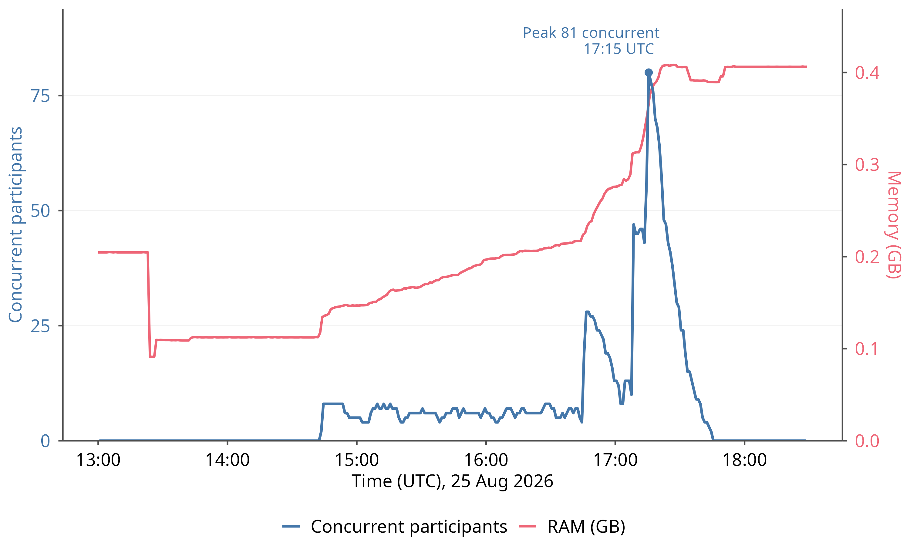

# Hosting an oTree study on Railway

This is the canonical how-to for putting an oTree study built from this template
onto Railway, and the source of truth for what a hosted deploy needs in general.
It is written to be followed by anyone: a researcher hosting their own study, or
an agent doing it for them; where a step needs account access or a human hand, it
is marked. It is a verified workflow, first used for `Experts/exp_pilots` on
2026-08-14 (live at `exp-pilots-production.up.railway.app`). Update this file when
the workflow improves.

> **Referenced by (update these if you move or rename this file):**
> - `docs/skills_claude/hosting_a_prolific_study.md` (the end-to-end agent playbook)
> - `docs/skills_claude/README.md` and `docs/README.md` (§6, §7)
> - `docs/running_on_prolific.md` (its intro links here for the hosting side)
> - `health.py`, `scripts/write_build_info.py`, `scripts/verify_deploy.py`
> - `ideas/railway-server-metrics-panel.md`, `.gitignore`, `DECISIONS.md`
> - **External, off-repo:** the CREED lab doc at `juliantait.eu/CREED`, section 5.1
>   "Running the Study Online" (source in the `juliantait.github.io` repo, file
>   `CREED Instructions/FAQ.tex`) links this path directly.

Companions: the study-side Prolific wiring a researcher configures (completion
codes, entry sequence, device gate, endings) is in
[`running_on_prolific.md`](./running_on_prolific.md); the end-to-end playbook that
drives both, plus the Prolific API and seats/money, is
[`skills_claude/hosting_a_prolific_study.md`](./skills_claude/hosting_a_prolific_study.md).

> **Two notes where this file describes `exp_pilots`, not this template:** the
> resetdb guard lives in `exp_pilots`' `start.sh`, whereas in this template it is
> the Dockerfile `CMD` calling `scripts/db_state.py`; and this template's
> `scripts/start.sh` is a HOST-SIDE room-binding script run against an already
> running server — it is not invoked at container boot and does not handle
> `PORT`. `PORT` is honoured by the Dockerfile `CMD`.

## Hosting is for online studies only, and this repo ships no deploy config

- Managed hosting is relevant **only to an online study**, in practice a Prolific
  one. **A lab study needs none of it** — it runs on the lab machine or a local
  server, and nothing on this page applies.
- **This repository deliberately contains no deployment architecture.** No
  Railway config, no `railway.json`, no Procfile, no deploy scripts, no CI, no
  provider account settings. Nothing here makes the repo deployable, and that is
  a decision, not an omission (`DECISIONS.md`).
- This page is a **written record of what such a deploy needs**, together with the
  one workflow that has actually been run (Railway), so it can be looked up and
  implemented. If you find yourself turning it into a config file, that is the
  line — stop, and raise it instead.

The one thing that IS in the image is data safety, and it is there for a different
reason. See "What is already in the image, and why" below.

## What a hosted deploy needs in general

1. **A container host that builds the existing `Dockerfile`.** The image is
   self-contained: a pinned oTree, the code, and a Postgres driver. Nothing in it
   is provider-specific, which is what keeps this repo portable.
2. **A managed Postgres**, and its connection string handed to the container as
   `DATABASE_URL`. Do not run an online study on the sqlite file: on a managed
   platform the container filesystem is usually ephemeral, so the file — and
   every participant in it — disappears on the next restart.
3. **The environment variables that make it a real study**, none of which are
   baked into the image on purpose:
   - `OTREE_PRODUCTION=1` — turns DEBUG off. Without it, participants get skip
     buttons and visible quiz answers.
   - `OTREE_AUTH_LEVEL=STUDY` plus `OTREE_ADMIN_PASSWORD` and `OTREE_REST_KEY` —
     otherwise the admin and `/demo` are open to anyone who finds the URL.
   - `OTREE_SECRET_KEY` — the dev fallback must not survive contact with the
     internet.
   - `PORT` if the platform assigns one.

   The concrete values, in Railway's reference-variable syntax, are in "Env vars
   for the app service" below; this list is what each one is FOR.
4. **An HTTPS domain**, which managed platforms provide. The image already trusts
   the proxy's `X-Forwarded-Proto` (`FORWARDED_ALLOW_IPS=*`); without that oTree
   builds `http://` links on an `https://` site and redirects and assets break.
5. **The Prolific wiring** — study URL, completion codes, and the return URL for
   a screened-out participant — which is study configuration, not hosting. It is
   in [`running_on_prolific.md`](./running_on_prolific.md) and guarded by
   `scripts/prelaunch_check.py`.
6. **A deploy that maps to an exact commit**, so you can say which code a given
   participant saw. A private repo holding only the experiment is the usual
   shape; the research monorepo need never be visible to the host. The Railway
   procedure below ("The shape") does this with `git subtree split`.

## What `DATABASE_URL` and the Postgres driver are for

`DATABASE_URL` is the **only** thing that chooses the database backend. oTree 6
reads it directly (`os.getenv('DATABASE_URL', 'sqlite:///db.sqlite3')`); unset
means the sqlite file. The `DB_NAME`/`DB_HOST` block in `settings.py` looks like
it selects Postgres and **does not** — oTree 6 dropped Django and never reads
`DATABASES`. Setting those and expecting Postgres gets you sqlite, silently
(`postgres_assumptions.md`).

`psycopg2-binary` is the driver that lets Python speak to Postgres at all.
`pip install otree` ships no database driver beyond sqlite's standard-library
module, so without it every Postgres URL fails at connection time. **This template
already ships it**, pinned `psycopg2-binary==2.9.12` in the Dockerfile; the note
stands for any project built from an older snapshot, which must add it before
Postgres hosting.

## What the boot guard protects against

The container will not initialise a database that already has tables in it. That
sounds obvious; it was not. The guard used to ask "is there a sqlite file?" as a
proxy for "is this database new?" — a proxy that is only true when the database
IS that file. Pointed at a managed Postgres, the file never exists, so the
condition was true on every boot and `otree resetdb` — which drops every table it
finds — ran against the live database on **every container restart**, silently,
with no error in the log. On a platform with an ephemeral filesystem that is
total data loss on every restart, discovered after a session. Fixed 2026-08-14
(Experts `79d49c2`; this template's `9d14738`): **any project built from an older
template snapshot MUST take this fix before Postgres hosting.**

It now asks the real question — *does this database already contain oTree's
tables?* — through oTree's own engine and oTree's own table names, so it means
the same thing on sqlite and Postgres. Behaviour worth knowing before your first
deploy:

- An **empty** database is initialised. A database with oTree's tables is left
  alone, restart after restart.
- A database that holds tables that are **NOT oTree's** is REFUSED rather than
  reset — it is somebody else's schema.
- A database that **does not answer yet** is retried for about a minute
  (`DB_WAIT_ATTEMPTS` × `DB_WAIT_SECONDS`, default 30 × 2s) — a managed Postgres
  is often not accepting connections at the instant the container starts.
- If it still cannot tell, **the container refuses to start** rather than
  initialising. That is deliberate: "I cannot see the database" and "the database
  is empty" are different answers, and treating the first as the second is what
  destroys data. A container that will not start is a line in the logs; a
  container that wipes a live study is a lost session.
- `RESET_DB=1` is the only deliberate wipe, on any backend.

So a refusal to boot is usually your connection string, not your build.

## What is already in the image, and why

`psycopg2-binary` and the Postgres-aware boot guard are in the image **for data
safety on any managed backend — not because Railway or any other provider has
been adopted.** They are there because the moment somebody points `DATABASE_URL`
at a managed database, the old file-existence guard would have destroyed it, and
because a guard that cannot connect refuses to boot — so shipping the guard
without the driver would have meant every Postgres deploy failing at 100% while
looking like a database problem. Both are about not losing participant data. They
commit this template to nothing.

## Caveats we could not test

Stated plainly because someone will hit them on a first deploy and should know
they were never exercised. The Postgres work was verified against a **local**
PostgreSQL 16 over plain TCP:

- **TLS (`?sslmode=require`)** — most managed providers require it. Untested
  here. If it is misconfigured the probe cannot connect, so the container refuses
  to boot; it fails toward refusing, not toward wiping.
- **Connection poolers** (PgBouncer and the like, which several platforms put in
  front of Postgres by default). Untested, and the likeliest of these to behave
  differently — a pooler can refuse or rewrite a connection, and in transaction
  pooling mode it can break assumptions a long-lived engine makes. If a deploy
  behaves oddly, try the direct connection string before anything else.
- **Docker itself was never run** in the work that produced the guard: no image
  build, no container boot. The startup command was executed directly with paths
  rewritten, and syntax-checked as the shell would parse it.
- **The `psycopg2-binary` pin was never installed in an image build**, only in a
  virtualenv alongside the same oTree version.

## The gap: there is no upgrade-path check for Postgres

**There is no upgrade-path check for a Postgres deployment.**
`scripts/predeploy_check.sh` — the gate that catches "this new build breaks for
participants who started before it" — is sqlite-only by design, and the
documented way to feed it a database (`docker cp` the sqlite file) does not exist
on Postgres. A hosted study is currently deployed without that gate. It is
honest about it (it reports `THE UPGRADE PATH WAS NOT TESTED`) but it cannot
cover you. `postgres_assumptions.md` has the full item and what closing it would
take; the short version is a container boot test first, then a Postgres fixture,
then a `pg_dump`-into-a-throwaway-database mode for the check.

Until that exists, the practical mitigation for an online study is the one oTree
forces anyway: **do not deploy new code over a running session.** Let the session
finish, deploy, then open the next one. (The Railway "Deploy ORDER" section below
makes the same point for a schema-changing build.)

## Agent autonomy: what the token gets you and where a human is unavoidable

With a project token **and an already-created project**, an agent can go end to
end on its own: deploy the code, create the service, set env vars, generate the
public domain, bind the session, and run the crash rehearsal. It **cannot** create
the project or the Postgres (account owner, in the dashboard), and cannot do the
custom-domain Cloudflare DNS step (a human, and only if a custom domain is chosen;
the generated domain avoids it). See the `HUMAN STEP` markers below.

## Why Railway

Managed host, ~$5–10 for a whole ~160-participant study (Hobby plan, usage-billed).
Reads the project's existing `Dockerfile` directly, one-click managed Postgres,
automatic HTTPS domain, browser dashboard with logs + restart. Full comparison of
alternatives: `Experts/reports/hosting_options.md` (local only — a document in the
research monorepo this template was extracted from; not in a copied study).
TreeHost is the zero-devops alternative (zip upload, free tier) but has no
CLI/API — dashboard only.

## The shape

1. **Dedicated deploy repo** — a private GitHub repo holding ONLY the experiment,
   made with `git subtree split` so it keeps the experiment's real commit history:
   ```sh
   cd <monorepo>            # e.g. Experts/
   git subtree split --prefix=<app_folder> -b <app>-export
   git push https://github.com/<your-account-or-org>/<deploy-repo>.git <app>-export:main
   ```
   Re-run both commands after every commit that should deploy (delete the branch
   first: `git branch -D <app>-export`). The deploy repo is a derived export —
   never develop against it. Rationale: Railway (a third party) never sees the
   research monorepo, and every deploy maps to an exact commit.
2. **Railway project** — Julian creates it in the dashboard (account, card,
   Hobby plan) and adds the Postgres there (`New -> Database -> PostgreSQL`;
   ONE, not two). Databases cannot be created with a project token.
3. **Project token** — the account owner creates it in the dashboard:
   project -> Settings -> Tokens. **Keep it OUTSIDE this repository** — a file
   in a gitignored directory, or your OS keychain. Where exactly is
   site-specific and deliberately not recorded here: this file is tracked and
   ships with every copy of the template, and a durable, precise pointer to
   where an API token lives is useless to any legitimate reader (who has their
   own token, on their own machine) and useful to nobody else you would want
   reading it. Never commit the token itself.

   It is PROJECT-scoped: env var `RAILWAY_TOKEN` (account tokens use
   `RAILWAY_API_TOKEN` instead). A small wrapper script that exports the token
   and calls the CLI keeps it off your shell history and out of every command;
   put that wrapper outside the repo too. Install the CLI without root by
   pointing npm at a prefix you own:
   `npm config set prefix <a-dir-you-own> && npm i -g @railway/cli`.

## What works with a project token, and how

| Action | Route |
|---|---|
| Deploy code | CLI: `railway up --service <name> --detach` from a clean clone of the deploy repo. Julian's decision (2026-08-14): keep this manual — no GitHub auto-deploy; the live study only changes on an explicit deploy |
| Check deploy status | GraphQL `deployments` query |
| Create the app service | GraphQL `serviceCreate` (CLI `add` fails with project tokens) |
| Set env vars | GraphQL `variableCollectionUpsert` (CLI `variables` unusable) |
| Public domain | GraphQL `serviceDomainCreate` -> `<service>-production.up.railway.app` |
| Restart | GraphQL `deploymentRestart(id)` |
| RAM/CPU metrics | GraphQL `metrics(serviceId, startDate, measurements: [MEMORY_USAGE_GB, CPU_USAGE])` |

GraphQL endpoint: `https://backboard.railway.app/graphql/v2` (the
`backboard.railway.com` host is an equivalent alias that serves the identical API
and also works, and is what the tool-guide source used, so either is fine if you
meet `.com` in the wild), header
`Project-Access-Token: <token>`, POST a `{"query": ..., "variables": ...}` JSON
payload **with curl** — python urllib gets Cloudflare 403 (error 1010). Pattern:
write the payload to a JSON file, post it with a small curl script. IDs needed in
payloads (projectId, environmentId, serviceId) come from `railway status` and the
`serviceCreate`/deploy responses.

## What a project token CANNOT do (so you attempt, then verify)

A project token is scoped to one project's services. Three operations you might
reach for return **`Not Authorized`**, and the point is the consequence, not the
list:

- `serviceUpdate` (renaming a service).
- `serviceDomainAvailable` (checking whether a domain name is free).
- creating a new **project** (and anything touching the account or another
  project).

Those need an **account token**, which is an account-owner operation in the
dashboard, not something a project token can do:

> **HUMAN STEP (no API for a project token).** Creating the project, and any
> account-scoped action, is done by the account owner in the Railway dashboard.
> A fresh agent cannot self-serve these with the project token it was handed.

The one that bites is `serviceDomainAvailable`. **You cannot check a name is free
before taking it,** so the workflow is never check-then-act. It is always
**attempt, then verify** (next section).

## Attempt, then verify: every Railway mutation

**A Railway mutation's return value is not evidence it did anything.** The proven
case: `serviceDomainUpdate` **returns `true` even when the requested name is
already taken and nothing changes.** A create can likewise report success against
a name you do not actually hold.

So make this a rule for every state-changing call, not just domains:

1. Run the mutation.
2. **Re-query the real state**, e.g. `domains { serviceDomains { domain } }`,
   or the `deployments`/`variables` query for what you changed.
3. **Curl the host** for a `200` where a domain or deploy is involved.

Never trust the mutation's own boolean. This is the same discipline as
"Verifying a deploy actually shipped" below and the crash rehearsal: a green
signal from the API is a claim, not a fact, and the only fact is the re-queried
state and the live host answering.

## Domains

- Generated domains are a **single label**: `<service>-production.up.railway.app`
  works, but `a.b.up.railway.app` fails TLS, because the wildcard cert covers one
  level only. Do not build a two-label generated host.
- `serviceDomainCreate` / `serviceDomainUpdate` are attempt-then-verify (above):
  re-query `serviceDomains` and curl the host, do not trust the return.
- **Custom domain:** Railway's cert issuance **fails while Cloudflare proxies the
  record.** Add the DNS record **grey-clouded (proxy off, DNS-only)**, let the
  cert issue, then turn the proxy back on if you want it (Cloudflare SSL mode must
  be **Full (strict)**).

  > **HUMAN STEP (no API).** The DNS record and its grey-cloud/orange-cloud
  > toggle live in the DNS provider's dashboard (Cloudflare), not in Railway. A
  > custom-domain deploy stalls here silently (the cert simply never issues)
  > unless a person sets the record DNS-only until it lands.

## Env vars for the app service

Purpose of each is in "What a hosted deploy needs in general" above; these are the
concrete values, in Railway's reference-variable syntax:

```
OTREE_AUTH_LEVEL=STUDY
OTREE_ADMIN_PASSWORD=<strong password>
OTREE_SECRET_KEY=<random>
OTREE_REST_KEY=<random>          # start.sh uses it to verify/bind the room session
DATABASE_URL=${{Postgres.DATABASE_URL}}   # reference variable, never paste creds
OTREE_PRODUCTION=1               # debug off; omit during smoke tests to keep skip buttons
```
Never set `RESET_DB` as a standing variable. `PORT` is injected by Railway and
**the Dockerfile `CMD` honours it** — in THIS template `start.sh` is a host-side
room-binding script that never sees `PORT` (see the scope note at the top of this
file; the sentence that used to say otherwise described `exp_pilots`).
`FORWARDED_ALLOW_IPS=*` is already in the template Dockerfile (needed behind any
TLS proxy).

## Deploy ORDER for a schema-changing build (order is load-bearing)

When a build changes the database schema (a rounds change, a new model field, a
page-sequence change), the reset must land **before** the new code boots, not
after. Deploying the code first guarantees one boot against an incompatible
database: the container dies, **Railway emails the account owner "Deploy
Crashed"**, and the app **502s** until the reset lands. Correct order:

1. `variableUpsert` `RESET_DB=1`.
2. `railway up`. The new build's **first** boot already resets, so it never
   meets the incompatible schema.
3. `variableDelete` `RESET_DB`.
4. Redeploy.

**Step 3 is not optional.** Railway restarts containers on its own, and a restart
with `RESET_DB` still set **destroys collected data**. Deleting the variable is
what stops the next spontaneous restart from wiping a live study.

Two guardrails from `CLAUDE.md` still bind here: `RESET_DB=1` is the **only**
deliberate wipe (the boot guard leaves a populated database alone otherwise), and
**`NUM_ROUNDS` is fixed at import, and a rounds or page-sequence change must never
be deployed over a live session at all.** A schema-changing deploy is for a study
between sessions, never one mid-flight.

## The deploy uploads what GIT would — and the build stamp is gitignored

**`railway up` honours `.gitignore`.** This is the single nastiest interaction in
the deploy, because the property that makes a file safe for git is exactly what
makes it invisible to the deploy:

- `BUILD_INFO.json` is the deploy build stamp. It is gitignored **correctly** — a
  commit cannot contain its own SHA, so a committed stamp would describe the
  previous commit.
- `railway up` therefore never uploads it. The image builds, the container boots,
  every page renders, `/health` answers 200, and **every deployed build reports
  itself `unstamped` forever.** Nothing fails. This happened.

The fix is to deploy from a **throwaway staging tree** that has no `.gitignore` in
it, and to give Railway a `.railwayignore` instead. The template's `.dockerignore`
is already the answer to "what must not go into this build", so copy it rather
than writing a second list that will drift from it:

```sh
STAGE="$(mktemp -d)"
git -C <deploy-repo> archive --format=tar HEAD | tar -x -C "$STAGE"

# The stamp, written INTO the staging tree. Values are passed explicitly so the
# writer never shells out to git (it also runs where there is no repo at all).
python3 "$STAGE/scripts/write_build_info.py" \
    --commit       "$(git -C <deploy-repo> rev-parse HEAD)" \
    --commit-date  "$(git -C <deploy-repo> log -1 --format=%cI)" \
    --subject      "$(git -C <deploy-repo> log -1 --format=%s)" \
    --build-number "$(git -C <deploy-repo> rev-list --count HEAD)" \
    --tree-clean   true \
    --out          "$STAGE/BUILD_INFO.json"

rm -f "$STAGE/.gitignore"                      # <- THE STEP THIS IS ALL ABOUT
cp "$STAGE/.dockerignore" "$STAGE/.railwayignore"

(cd "$STAGE" && railway up --service <name> --detach)
```

`git archive` gives a tree of tracked files only, so the staging copy starts
clean; deleting `.gitignore` from it changes nothing about the repo you develop
in. **Never delete `.gitignore` from your working checkout to make this work** —
the stamp would then be committable, which is the recursion the whole design
exists to avoid.

Two related notes:

- **Do not "sync" `.dockerignore` with `.gitignore`.** They overlap and are not
  the same list, and `BUILD_INFO.json` is the file where copying a line across
  does real damage: gitignored on purpose, and it MUST reach the build context.
  `scripts/tests/build_context_test.py` asserts it is not excluded.
- **Cookie jars belong in `.gitignore` by PATTERN, not by name.** They arrive
  only from ad-hoc curl debugging against a running server, and the one in
  `exp_pilots` was committed holding a live admin session cookie. The next one
  will not be called `cookies.txt`, so match the shape. The template ships those
  patterns in both `.gitignore` and `.dockerignore`.

## SUCCESS is a claim about the BUILD, not about the APP

**A Railway deploy reporting `SUCCESS` is not evidence the application is
alive.** Ours reported SUCCESS with the container already exited, and the study
502'd. `SUCCESS` means the image built and was promoted; it says nothing about
whether the process is still running, whether the database was reachable, or
whether a session is bound to the room.

Two independent things to do about it, and they are not substitutes:

1. **Set the service's `healthcheckPath`** — it is `null` on a default service.
   With it set, Railway itself refuses to promote a build that never becomes
   healthy, so a broken deploy leaves the PREVIOUS version serving instead of
   taking the study down. It is a service setting, not a file: this repo
   deliberately ships no `railway.json` (see `docs/README.md`), so set it in the
   dashboard, or with the GraphQL mutation:

   ```graphql
   mutation SetHealthcheck($id: String!, $env: String!, $input: ServiceInstanceUpdateInput!) {
     serviceInstanceUpdate(serviceId: $id, environmentId: $env, input: $input)
   }
   ```
   ```json
   {"id": "<serviceId>", "env": "<environmentId>",
    "input": {"healthcheckPath": "/health", "healthcheckTimeout": 300}}
   ```
   Then **attempt, then verify** as always: re-query the service instance and
   confirm the path came back as `/health`.

2. **Run the post-deploy check by hand** (`scripts/verify_deploy.py`). It is the
   only thing that compares the build you just deployed against the build that is
   actually answering — which is the assertion that catches the gitignored-stamp
   trap above, and the one a health check can never make, because a perfectly
   healthy container can be serving last week's code.

   ```sh
   OTREE_REST_KEY=<your key> python3 scripts/verify_deploy.py \
       --base-url https://<your-service>.up.railway.app \
       --build-info "$STAGE/BUILD_INFO.json"      # the stamp you just deployed
   ```

   It is read-only, issues only GETs, and never requests a URL that would hand
   it a participant slot, so it is safe against a live study. Exit 0 means the
   deployment IS that build and is serving; exit 1 names the assertion that
   failed and what it saw. Because a container may still be booting it retries
   against a deadline (`--deadline`, default 300s). `docs/README.md` §7 has the
   rest.

## Hard-won gotchas

- **The resetdb wipe trap** is the reason the boot guard exists. The full
  mechanism, the fix, and the commit refs are in "What the boot guard protects
  against" above. The operational takeaway for a deploy: reset happens only on
  explicit `RESET_DB=1` or an empty database, an unreachable database is retried
  (~60s) before boot is refused, and any project on an older template snapshot
  MUST take the fix before Postgres hosting.
- **Postgres driver.** The Dockerfile needs `psycopg2-binary` or the app dies on
  connect. Already done in this template (pinned `psycopg2-binary==2.9.12`); see
  "What `DATABASE_URL` and the Postgres driver are for" above. The note stands
  for any project on an older snapshot.
- **`railway up` can transiently 500** ("Failed to upload", deployment shows
  FAILED with no build attached). Just retry after ~45s; it clears.
- **Variable changes trigger their own redeploy** — set vars, then confirm the
  new deployment reaches SUCCESS before judging anything.
- **Session binding**: start.sh binds the configured session to the room when
  you run it against the live server (fail-loud), reusing an existing binding
  rather than replacing it. Verify with the REST API:
  `curl -H "otree-rest-key: <key>" https://<domain>/api/rooms`.
- **A big session creation is slow, and that is not a failure.** `POST
  /api/sessions` builds every participant x round row inside the request, so a
  large room legitimately runs for minutes. `start.sh` gives the creation its own
  generous timeout (`OTREE_START_CREATE_TIMEOUT`, default 600s) separate from the
  short one on the room read (`OTREE_START_READ_TIMEOUT`, default 20s) — sharing
  one timeout between the two classes is what killed the `exp_pilots` boot script,
  which read a slow SUCCESS as a failure and exited. If a creation does time out
  client-side, **the script re-reads the room before calling it fatal**: the POST
  may have completed after curl stopped listening, and a blind retry would bind a
  second session over a live one. Re-running the script is always safe.

## The crash rehearsal (do this before any paid run)

1. Note the bound `session_code` from `/api/rooms`.
2. `deploymentRestart` the live deployment.
3. Confirm the SAME session code afterwards. Same code = data survives restarts.

## Study day

Participant link: `https://<domain>/room/<room_name>?participant_label={}`.
Real Prolific completion codes must be committed in settings before launch (the
boot banner lists what is still placeholder).

**Launch sequence — order is load-bearing:** codes committed → deploy → **bind a
FRESH session**. A session's config is frozen at creation, so any session created
before the codes commit keeps the placeholder frozen inside it: its completers
get sent to `cc=<placeholder>` unpaid while the boot banner reads clean (it only
inspects today's settings). Never reuse a pre-codes session, however tempting.
Note the boot-time room bind only verifies an existing binding — it will not
replace one — so binding the fresh session is an explicit manual step; verify via
`/api/rooms` that the bound `session_code` is NEW. `screenout_return_url` is a
plain URL, not a code: it must be ABSOLUTE (`https://…`) — a relative value
silently loops screened-out phones back into the study (found by live fuzzing
2026-08-14). Export data periodically from the
admin panel during the run. After the study: export, then delete the app service
(keep Postgres briefly if the data should stay live, then delete it too).

## Appendix: performance and usage statistics

*Measured under real load, with the `exp_pilots` run as the worked case
(2026-09-13).*

This appendix tells you what to expect when you host a Prolific study built from
this template on Railway, and it is backed by measurements rather than guesses. A
study forked from this template (`exp_pilots`) ran its real data collection on
Railway and we now have its telemetry under genuine participant load. The numbers
below are all from that run. The step-by-step how-to (provisioning the container,
the managed database, deploy commands) is the body of this file above; this
appendix is the "does it cope, and how big does it need to be" answer that sits
alongside it.

> This supersedes the earlier `_ai/railway_report.tex` (the 2026-08-23 ten-place
> timing wave), which observed a peak of only 9 concurrent participants and
> *projected* resource use linearly out to 220. That projection is broadly
> confirmed here by a real run: it forecast roughly 0.39 vCPU and 0.52 GB at 220
> concurrent, and the measured run below drew 0.26 vCPU and 0.41 GB at 81
> concurrent — the same small envelope, now measured rather than extrapolated.

### The stack

The whole deployment is **one small Railway container running the oTree app,
plus Railway's managed Postgres**. There is no load balancer, no worker pool, no
cache tier, no autoscaling group. This is the setup the template is designed for,
and the measurements below are its verdict: for a Prolific-scale study it is not
merely adequate, it has large headroom.

### The load that was served

The `exp_pilots` pilot drew **195 participants** in total, across two Prolific
waves: a small release (15 people, never more than 9 in the task at once) and the
main batch of **180**. Sessions were short — a **median of 12.3 minutes** — and
that is exactly what makes the load *bursty* rather than sustained: Prolific opens
the places, people arrive in a clump, move through the task quickly, and drain away.

The main batch is the real stress test. Arrivals trickled in under ten concurrent
through the afternoon, then the Prolific batch release produced a sharp ramp that
peaked at **81 simultaneous participants at 17:15 UTC** before draining by roughly
17:40. That single hour carried **9,656 requests**, out of **31,390** across the
whole run (Aug 14 – Sep 12); everything outside the two waves was near-idle traffic.
Figure 1 shows the concurrency burst against the container's memory over the same
window.



### What it cost the box

The striking result is how cheap 81 concurrent participants turned out to be.

- **CPU** was essentially nothing when idle (about 0.001–0.01 of one core). At the
  burst it rose to a peak of **0.26 cores — 26% of a single core — and only for
  about a minute**; averaged over the whole peak hour, CPU use was around **6%**.
- **RAM** ran at roughly **0.1–0.3 GB** through the day and peaked at just **0.41 GB**
  during the burst.

So the worst moment of the run consumed about **a quarter of one CPU core and under
half a gigabyte of memory**. That is a small container barely being touched, not one
under strain. The managed Postgres absorbed every participant write without appearing
anywhere in the container's resource picture.

### Latency: did it slow down under load?

No — if anything it was faster when busy. Comparing the quiet warmup hour with the
peak hour:

- **Warmup (13:00, near-idle):** p50 96 ms, p90 131 ms, p99 178 ms.
- **Peak (17:00, 9,656 requests):** p50 **25 ms**, p90 **101 ms**, p99 **406 ms**.

The median response was *lower* at the peak than during the quiet hour — a warm
container with hot caches under real traffic beats a cold idle one — and even the
99th-percentile tail stayed under half a second. There is no sign of queueing,
thrashing, or degradation as concurrency climbed.

### Reliability

Server errors were vanishingly rare and **none touched a participant**. Across the
whole run there were **26 5xx responses — 0.08% of all requests** — and every one
fell inside two deploy-crash windows during near-idle traffic: a two-step deploy
booted against the old database (Aug 17, 3 × 502), and a deploy that reported
success while the container had actually exited (Aug 22, 23 × 502/500). Both were
operator mistakes during quiet windows, not platform failures under load, and there
were **zero 5xx errors during either participant wave**. The remaining non-5xx noise
is what any public URL attracts: 1,255 404s from bots and scanners, and 910 499s
from clients closing the connection early.

### Cost

Railway bills **per minute of uptime**, so the true cost of a study is only the hours
the service is actually running — not the calendar period it spans. At the observed
average resources (~0.43 GB RAM, ~0.005 of a vCPU, at ~$10/GB-month and ~$20/vCPU-month)
the app costs about **$0.006 per hour of uptime**, or roughly **$0.01/hour all-in with
the managed Postgres**. The actual study — a few hours of real serving across the two
waves — therefore cost on the order of **a few cents**, and even generously leaving the
service up for a whole day per wave stays well under a dollar.

The ~**$2–3** we actually paid was not the cost of the study: it was the cost of
**leaving the service up, idle, for ~18 days**. Over that window the project used
**11,109 GB-minutes of RAM** and **120.6 vCPU-minutes** — about $2.6 of memory and
$0.06 of CPU — which still sits inside the $5/month Hobby plan's included usage, but is
mostly idle time we did not need to pay for. The practical guidance follows directly:
**spin the service up shortly before recruiting and tear it down (or pause it) once the
data is exported**, keeping the managed Postgres or a snapshot if you need to serve
returns or reviews later.

The prior setup, Heroku, bills the opposite way: a **fixed monthly amount regardless of
use**. Paid dynos start at ~$7 (Basic), ~$25 (Standard-1X) or ~$50 (2X) each with no
free tier since 2022, plus a Postgres add-on (~$5–50/month), plus historically an oTree
Hub subscription — so a few dynos + Postgres + Hub is on the order of **tens of dollars
per month, whether the study runs for three hours or not at all**. For a short study the
gap is not an order of magnitude, it is dramatic: **cents of actual-uptime compute on
Railway versus tens of dollars of fixed monthly cost on Heroku** — and Railway is a
single dashboard rather than a multi-piece subscription stack.

### Scaling verdict

A single small Railway container backed by managed Postgres served the entire pilot
without strain: at the busiest moment, 81 participants in the task at once cost about
26% of one CPU core and 0.41 GB of RAM, response times held at a 25 ms median (faster
under load than at rest), and not one server error reached a participant. With CPU
peaking near a quarter of one core and memory under half a gigabyte, this setup has
room to absorb **several multiples of 81 concurrent** before the container itself
would need to grow, and the managed Postgres scales independently of it. Host your
study on the same single-container-plus-managed-Postgres setup with no architectural
change; the practical lever, if a future release ever bunches arrivals harder than
this one did, is **Prolific's batch-release pacing, not a bigger server**. The one
operational rule this run teaches — because the only failures in it were
self-inflicted deploys — is **never deploy a schema change while participants are
live**: guard it with the RESET_DB-before-schema-deploy rule, `scripts/verify_deploy.py`,
and the `/health` healthcheck so a dead container can no longer report a successful
deploy.
